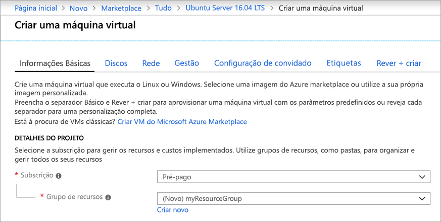
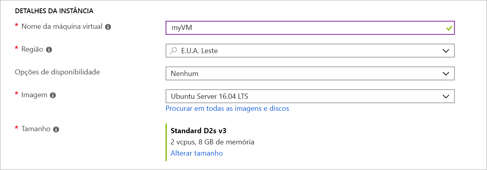
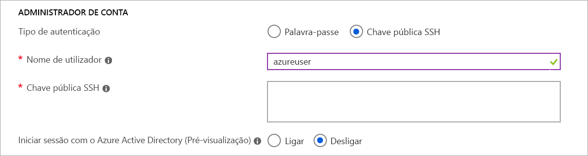

# <a name="quickstart-create-a-linux-virtual-machine-in-the-azure-portal"></a>Início Rápido: Criar uma máquina virtual do Linux no portal do Azure

As máquinas virtuais do Azure (VMs) podem ser criadas através do portal do Azure. O portal do Azure é uma interface de utilizador baseada no browser para criar VMs e os respetivos recursos associados. Este início rápido mostra como utilizar o portal do Azure para implementar uma máquina virtual (VM) do Linux com o Ubuntu 16.04 LTS. Para ver a VM em ação, estabeleça o SSH para a VM e instale o servidor Web NGINX.

Se não tiver uma subscrição do Azure, crie uma [conta gratuita](https://azure.microsoft.com/free/?WT.mc_id=A261C142F) antes de começar.

## <a name="create-ssh-key-pair"></a>Criar o par de chaves SSH

Precisa de um par de chaves SSH para concluir este início rápido. Se já tiver um par de chaves SSH, pode ignorar este passo.

Abra uma shell do Bash e utilize [ssh-keygen](https://www.ssh.com/ssh/keygen/) para criar um par de chaves SSH. Se não tiver uma shell do Bash no computador local, pode utilizar o [Azure Cloud Shell](https://shell.azure.com/bash).  

```bash
ssh-keygen -t rsa -b 2048
```

O comando acima gera as chaves públicas e privadas com o nome predefinido `id_rsa` em `~/.ssh directory`. O comando devolve o caminho completo para a chave pública. Utilize o caminho para a chave pública para apresentar o respetivo conteúdo com `cat`.

```bash 
cat ~/.ssh/id_rsa.pub
```

Guarde o resultado deste comando. Irá precisar dele quando configurar a conta de administrador para iniciar sessão na VM.

Para obter informações mais detalhadas sobre como criar pares de chaves SSH, incluindo a utilização do PuTTy, veja [Como utilizar chaves SSH com o Windows](ssh-from-windows.md).

Se criar o par de chaves SSH com o Cloud Shell, este será armazenado numa Partilha de Ficheiros do Azure [montado automaticamente pelo Cloud Shell](https://docs.microsoft.com/azure/cloud-shell/persisting-shell-storage). Não elimine esta partilha de ficheiros ou conta de armazenamento até ter obtido as chaves ou perderá o acesso à VM. 

## <a name="sign-in-to-azure"></a>Iniciar sessão no Azure

Inicie sessão no [portal do Azure](https://portal.azure.com).

## <a name="create-virtual-machine"></a>Criar a máquina virtual

1. Selecione **Criar um recurso** no canto superior esquerdo do portal do Azure.

1. Na caixa de pesquisa acima da lista de recursos do Azure Marketplace, procure e selecione **Ubuntu Server 16.04 LTS** da Canonical e, em seguida, selecione **Criar**.

1. No separador **Informações básicas**, em **Detalhes do projeto**, certifique-se de que está selecionada a subscrição correta e, em seguida, selecione **Criar novo** em **Grupo de recursos**. No pop-up, escreva *myResourceGroup* no nome do grupo de recursos e, em seguida, selecione **OK**. 

    

1. Em **Detalhes da instância**, escreva *myVM* para o **Nome da máquina virtual** e selecione *E.U.A. Leste* para a **Região**. Mantenha as restantes predefinições inalteradas.

    

1. Em **Conta de administrador**, selecione **Chave pública SSH**, escreva o seu nome de utilizador e, em seguida, cole a chave pública na caixa de texto. Remova quaisquer espaços em branco à esquerda ou à direita na chave pública.

    

1. Em **Regras da porta de entrada** > **Portas de entrada públicas**, selecione **Permitir portas selecionadas** e, em seguida, selecione **SSH (22)** e **HTTP (80)** na lista pendente. 

    

1. Mantenha as restantes predefinições e, em seguida, selecione o botão **Rever + criar** na parte inferior da página.

1. Na página **Criar uma máquina virtual**, pode ver os detalhes sobre a VM que está prestes a criar. Quando estiver pronto, selecione **Criar**.

Irá demorar alguns minutos até a VM ser implementada. Quando a implementação estiver concluída, avance para a secção seguinte.

    
## <a name="connect-to-virtual-machine"></a>Conectar à máquina virtual

Crie uma ligação SSH à VM.

1. Selecione o botão **Ligar** na página de descrição geral da VM. 

    

2. Na página **Ligar à máquina virtual**, mantenha as opções predefinidas para estabelecer ligação por endereço IP através da porta 22. Em **Iniciar sessão com uma conta local da VM**, é apresentado um comando de ligação. Clique no botão para copiar o comando. O exemplo seguinte mostra o aspeto do comando de ligação SSH:

    ```bash
    ssh azureuser@10.111.12.123
    ```

3. Com a mesma shell do Bash que utilizou para criar o par de chaves SSH (como o [Azure Cloud Shell](https://shell.azure.com/bash) ou a shell do Bash local), cole o comando de ligação SSH na shell para criar uma sessão SSH. 

## <a name="install-web-server"></a>Instalar o servidor Web

Para ver a VM em ação, instale o servidor Web NGINX. Na sessão SSH, atualize as origens do pacote e, em seguida, instale o pacote NGINX mais recente.

```bash
sudo apt-get -y update
sudo apt-get -y install nginx
```

Quando terminar, escreva `exit` para deixar a sessão SSH.


## <a name="view-the-web-server-in-action"></a>Ver o servidor Web em ação

Utilize um browser à sua escolha para ver a página predefinida de boas-vindas do NGINX. Introduza o endereço IP público da VM como o endereço Web. O endereço IP público pode ser encontrado na página de descrição geral da VM ou como parte da cadeia de ligação SSH que utilizou anteriormente.


## <a name="clean-up-resources"></a>Limpar recursos

Quando já não forem necessários, pode eliminar o grupo de recursos, a máquina virtual e todos os recursos relacionados. Para tal, selecione o grupo de recursos para a máquina virtual, selecione **Eliminar** e confirme o nome do grupo de recursos a eliminar.

## <a name="next-steps"></a>Passos seguintes

Neste início rápido, implementou uma máquina virtual simples, criou um Grupo de Segurança de Rede e uma regra e instalou um servidor Web básico. Para saber mais sobre as máquinas virtuais do Azure, continue para o tutorial das VMs do Linux.

> [!div class="nextstepaction"]
> [Tutoriais das máquinas virtuais do Linux do Azure](./tutorial-manage-vm.md)
