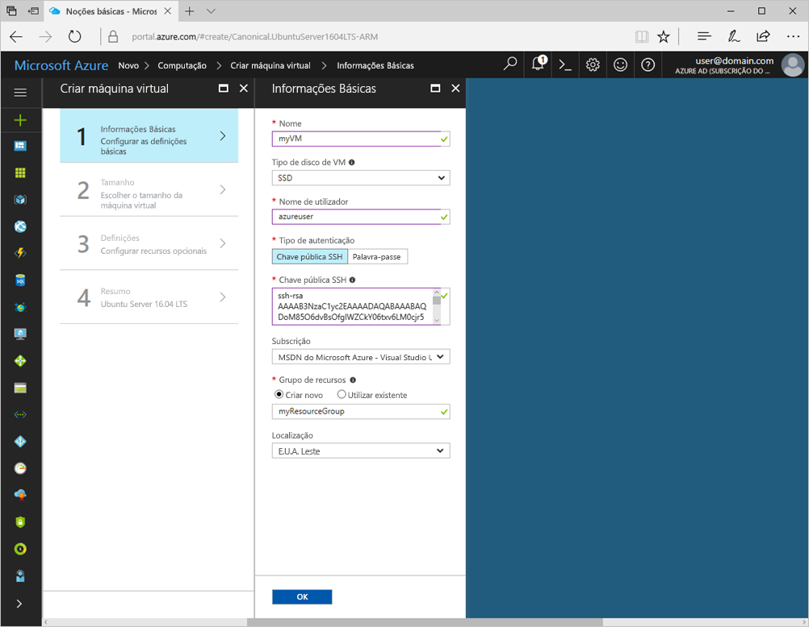
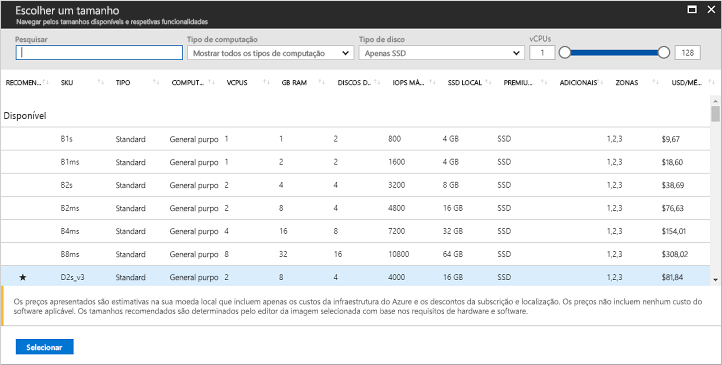
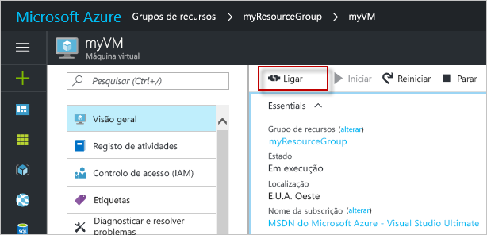

# <a name="quickstart-create-a-linux-virtual-machine-in-the-azure-portal"></a>Início Rápido: Criar uma máquina virtual do Linux no portal do Azure

As máquinas virtuais do Azure (VMs) podem ser criadas através do portal do Azure. Este método fornece uma interface de utilizador baseada no browser para criar VMs e os respetivos recursos associados. Este início rápido mostra como utilizar o portal do Azure para implementar uma máquina virtual (VM) do Linux no Azure que executa o Ubuntu. Para ver a VM em ação, estabeleça o SSH para a VM e instale o servidor Web NGINX.

Se não tiver uma subscrição do Azure, crie uma [conta gratuita](https://azure.microsoft.com/free/?WT.mc_id=A261C142F) antes de começar.

## <a name="create-ssh-key-pair"></a>Criar o par de chaves SSH

Precisa de um par de chaves SSH para concluir este início rápido. Se tiver um par de chaves SSH existente, este passo pode ser ignorado.

Para criar um par de chaves SSH e iniciar sessão nas VMs do Linux, execute o seguinte comando a partir da shell do Bash e siga as direções no ecrã. Por exemplo, pode utilizar o [Azure Cloud Shell](../../cloud-shell/overview.md) ou o [Windows Substem for Linux](/windows/wsl/install-win10). A saída do comando inclui o nome de ficheiro do ficheiro de chave pública. Copie o conteúdo do ficheiro de chave pública (`cat ~/.ssh/id_rsa.pub`) para a área de transferência:

```bash
ssh-keygen -t rsa -b 2048
```

Para obter informações mais detalhadas sobre como criar pares de chaves SSH, incluindo a utilização do PuTTy, veja [Como utilizar chaves SSH com o Windows](ssh-from-windows.md).

## <a name="log-in-to-azure"></a>Iniciar sessão no Azure

Inicie sessão no portal do Azure em http://portal.azure.com

## <a name="create-virtual-machine"></a>Criar a máquina virtual

1. Selecione **Criar um recurso**, no canto superior esquerdo do portal do Azure.

2. Na caixa de pesquisa acima da lista de recursos do Azure Marketplace, procure e selecione **Ubuntu Server 16.04 LTS** da Canonical e, em seguida, selecione **Criar**.

3. Indique um nome para a VM, como *myVM*, deixe o tipo de disco como *SSD* e forneça um nome de utilizador, como *azureuser*.

4. . Para **Tipo de autenticação**, selecione **Chave pública SSH** e, em seguida, cole a chave pública na caixa de texto. Remova quaisquer espaços em branco à esquerda ou à direita na chave pública.

    

5. Selecione **Criar novo grupo de recursos** e forneça um nome, como *myResourceGroup*. Selecione a **Localização** que quer e, em seguida, **OK**.

4. Selecione um tamanho para a VM. Pode filtrar por *Tipo de computação* ou *Tipo de disco*, por exemplo. Um tamanho de VM sugerido é *D2s_v3*.

    

5. Em **Definições**, mantenha todas as predefinições e selecione **OK**.

6. Na página de resumo, selecione **Criar** para iniciar a implementação da VM.

7. A VM é afixada ao dashboard do portal do Azure. Depois de concluída a implementação, o resumo da VM abre-se automaticamente.

## <a name="connect-to-virtual-machine"></a>Conectar à máquina virtual

Crie uma ligação SSH à VM.

1. Selecione o botão **Ligar** na página de descrição geral da VM. 

    

2. Na página **Ligar à máquina virtual**, mantenha as opções predefinidas para estabelecer ligação por nome DNS através da porta 22. Em **Iniciar sessão com uma conta local da VM**, é apresentado um comando de ligação. Clique no botão para copiar o comando. O exemplo seguinte mostra o aspeto do comando de ligação SSH:

    ```bash
    ssh azureuser@myvm-123abc.eastus.cloudapp.azure.com
    ```

3. Cole o comando de ligação SSH numa shell, como o Azure Cloud Shell ou o Bash no Ubuntu no Windows, para criar a ligação. 

## <a name="install-web-server"></a>Instalar o servidor Web

Para ver a VM em ação, instale o servidor Web NGINX. Para atualizar as origens dos pacotes e instalar o pacote NGINX mais recente, execute os seguintes comandos na sua sessão SSH:

```bash
# update packages
sudo apt-get -y update

# install NGINX
sudo apt-get -y install nginx
```

Quando terminar, `exit` da sessão SSH e volte às propriedades da VM no portal do Azure.

## <a name="open-port-80-for-web-traffic"></a>Abrir a porta 80 para o tráfego da Web

Um Grupo de Segurança de Rede (NSG) protege os tráfegos de entrada e de saída. Quando cria uma VM a partir do portal do Azure, é criada uma regra de entrada na porta 22 para ligações SSH. Como esta VM aloja um servidor Web, tem de ser criada uma regra NSG para a porta 80.

1. Na página de descrição geral da VM, selecione **Redes**.
2. É apresentada a lista de regras de entrada e saída existentes. Selecione **Adicionar regra de porta de entrada**.
3. Selecione a opção **Básico** na parte superior e *HTTP* na lista de serviços disponíveis. A porta 80, uma prioridade e o nome são detalhes indicados para si.
4. Para criar a regra, selecione **Adicionar**.

## <a name="view-the-web-server-in-action"></a>Ver o servidor Web em ação

Com o NGINX instalado e a porta 80 aberta para a VM, torna-se possível aceder ao servidor Web a partir da Internet. Abra um browser e introduza o endereço IP público da VM. O endereço IP público pode ser encontrado na página de descrição geral da VM ou na parte superior da página *Redes*, onde pode adicionar a regra de porta de entrada.


## <a name="clean-up-resources"></a>Limpar recursos

Quando já não forem necessários, pode eliminar o grupo de recursos, a máquina virtual e todos os recursos relacionados. Para tal, selecione o grupo de recursos para a máquina virtual, selecione **Eliminar** e confirme o nome do grupo de recursos a eliminar.

## <a name="next-steps"></a>Passos seguintes

Neste início rápido, implementou uma máquina virtual simples, criou um Grupo de Segurança de Rede e uma regra e instalou um servidor Web básico. Para saber mais sobre as máquinas virtuais do Azure, continue para o tutorial das VMs do Linux.

> [!div class="nextstepaction"]
> [Tutoriais das máquinas virtuais do Linux do Azure](./tutorial-manage-vm.md)
