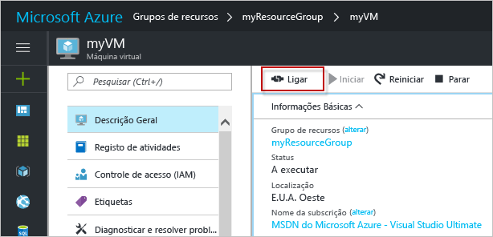

# <a name="quickstart-create-a-windows-virtual-machine-in-the-azure-portal"></a>Início Rápido: Criar uma máquina virtual do Windows no portal do Azure

As máquinas virtuais do Azure (VMs) podem ser criadas através do portal do Azure. Este método fornece uma interface de utilizador baseada no browser para criar VMs e os respetivos recursos associados. Este início rápido mostra como utilizar o portal do Azure para implementar uma máquina virtual (VM) no Azure que executa o Windows Server 2016. Para ver a VM em ação, estabeleça o RDP para a VM e instale o servidor Web IIS.

Se não tiver uma subscrição do Azure, crie uma [conta gratuita](https://azure.microsoft.com/free/?WT.mc_id=A261C142F) antes de começar.

## <a name="sign-in-to-azure"></a>Iniciar sessão no Azure

Inicie sessão no portal do Azure em https://portal.azure.com.

## <a name="create-virtual-machine"></a>Criar a máquina virtual

1. Selecione **Criar um recurso**, no canto superior esquerdo do portal do Azure.

2. Na caixa de pesquisa acima da lista de recursos do Azure Marketplace, procure e selecione **Windows Server 2016 Datacenter** e, em seguida, selecione **Criar**.

3. Indique um nome para a VM, como *myVM*, deixe o tipo de disco como *SSD* e forneça um nome de utilizador, como *azureuser*. A palavra-passe tem de ter, pelo menos, 12 carateres e cumprir os [requisitos de complexidade definidos](faq.md#what-are-the-password-requirements-when-creating-a-vm).

    

5. Selecione **Criar novo grupo de recursos** e forneça um nome, como *myResourceGroup*. Selecione a **Localização** e, em seguida, **OK**.

4. Selecione um tamanho para a VM. Pode filtrar por *Tipo de computação* ou *Tipo de disco*, por exemplo. Um tamanho de VM sugerido é *D2s_v3*. Clique em **Selecionar** depois de escolher um tamanho.

    

5. Na página **Definições**, em **Rede** > **Grupo de Segurança de Rede** > **Selecionar portas de entrada públicas**, selecione **HTTP** e **RDP (3389)** na lista pendente. Deixe o resto das predefinições e selecione **OK**.

6. Na página de resumo, selecione **Criar** para iniciar a implementação da VM.

7. A VM é afixada ao dashboard do portal do Azure. Depois de concluída a implementação, o resumo da VM abre-se automaticamente.

## <a name="connect-to-virtual-machine"></a>Conectar à máquina virtual

Crie uma ligação de ambiente de trabalho remoto para a máquina virtual. Estas instruções indicam como ligar à VM a partir de um computador Windows. Num Mac, precisa de um cliente RDP como este [Cliente de Ambiente de Trabalho Remoto](https://itunes.apple.com/us/app/microsoft-remote-desktop/id715768417?mt=12) a partir da Mac App Store.

1. Clique no botão **Ligar** na página de propriedades da máquina virtual. 

    
    
2. Na página **Ligar à máquina virtual**, mantenha as opções predefinidas para estabelecer ligação por nome DNS através da porta 3389 e clique em **Transferir ficheiro RDP**.

2. Abra o ficheiro RDP transferido e clique em **Ligar** quando lhe for pedido. 

3. Na janela **Segurança do Windows**, selecione **Mais escolhas** e **Utilizar uma conta diferente**. Escreva o nome de utilizador como *vmname*\**, introduza a palavra-passe que criou para a máquina virtual e clique em **OK**.

4. Poderá receber um aviso de certificado durante o processo de início de sessão. Clique em **Sim** ou **Continuar** para criar a ligação.

## <a name="install-web-server"></a>Instalar o servidor Web

Para ver a VM em ação, instale o servidor Web do IIS. Abra uma janela do PowerShell na VM e execute o comando seguinte:

```powershell
Install-WindowsFeature -name Web-Server -IncludeManagementTools
```

Quando terminar, feche a ligação RDP à VM.


## <a name="view-the-iis-welcome-page"></a>Ver a página de boas-vindas do IIS

No portal, selecione a VM e na descrição geral da VM, utilize o botão **Clicar para copiar** à direita do endereço IP para copiá-lo e colá-lo num separador do browser. A página de boas-vindas do IIS predefinida será aberta e deverá ser semelhante ao seguinte:


## <a name="clean-up-resources"></a>Limpar recursos

Quando já não forem necessários, pode eliminar o grupo de recursos, a máquina virtual e todos os recursos relacionados. Para tal, selecione o grupo de recursos para a máquina virtual, selecione **Eliminar** e confirme o nome do grupo de recursos a eliminar.

## <a name="next-steps"></a>Passos seguintes

Neste guia de início rápido, implementou uma máquina virtual simples, abriu uma porta de rede para o tráfego Web e instalou um servidor Web básico. Para saber mais sobre as máquinas virtuais do Azure, continue com o tutorial para VMs do Windows.

> [!div class="nextstepaction"]
> [Tutoriais de máquinas virtuais do Windows do Azure](./tutorial-manage-vm.md)
