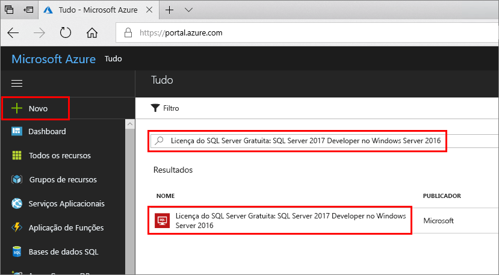
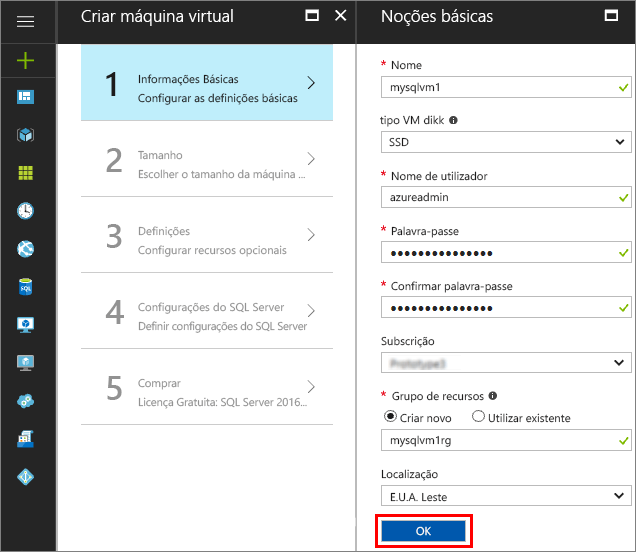
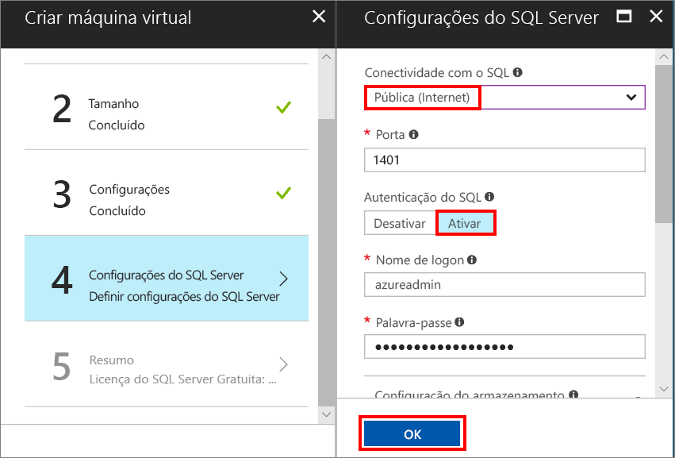
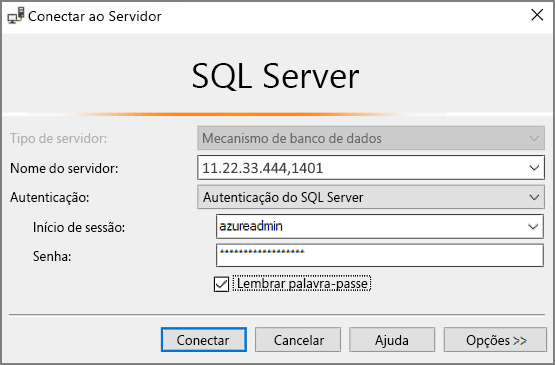

# Crie uma máquina virtual do SQL Server 2017 Windows no portal do Azure

> [!div class="op_single_selector"]
> * [Windows](quickstart-sql-vm-create-portal.md)
> * [Linux](../../linux/sql/provision-sql-server-linux-virtual-machine.md)

Estes passos do guia de introdução explicam a criação de uma máquina virtual de SQL Server com o portal do Azure.

Se não tiver uma subscrição do Azure, crie uma [conta gratuita](https://azure.microsoft.com/free/?WT.mc_id=A261C142F) antes de começar.

##  Selecionar uma imagem de VM do SQL Server

1. Inicie sessão no [Portal do Azure](https://portal.azure.com) utilizando a sua conta.

1. No Portal do Azure, clique em **Novo**. O portal abre a janela **Novo**.

1. No campo de pesquisa, escreva **SQL Server 2017 Developer on Windows Server 2016** (SQL Server 2017 Developer no Windows Server 2016) e prima ENTER.

1. Selecione a imagem **Free SQL Server License: SQL Server 2017 Developer on Windows Server 2016 (Licença do SQL Server gratuita: SQL Server 2017 Developer no Windows Server 2016)**.

   

   > [!TIP]
   > A edição de Programador é utilizada neste tutorial porque é uma edição com todas as funcionalidades do SQL Server que é gratuita para fins de teste de programação. Apenas paga pelo custo de execução da VM. Para obter considerações mais compeltas sobre preços, consulte [Pricing guidance for SQL Server Azure VMs (Documentação de orientação sobre preços de VMs do Azure do SQL Server)](virtual-machines-windows-sql-server-pricing-guidance.md).

1. Clique em **Criar**.

##  Forneça os detalhes básicos

Na janela **Informações Básicas**, forneça as seguintes informações:

1. No campo **Nome**, introduza um nome de máquina virtual exclusivo. 

1. No campo **Nome de utilizador**, introduza um nome para a conta de administrador local na VM.

1. Forneça uma **Palavra-passe** forte.

1. Introduza um novo nome para o **Grupo de recursos**. Este grupo ajudar a gerir todos os recursos associados à máquina virtual.

1. Verifique as outras predefinições e clique em **OK** para continuar.

   

## Selecionar o tamanho da máquina virtual

No passo **Tamanho**, escolha um tamanho de máquina virtual na janela **Escolher um tamanho**. Inicialmente, a janela apresenta os tamanhos de máquina recomendados com base na imagem que selecionou. 

1. Clique em **Ver todos** para ver todos os tamanhos de máquinas disponíveis.

1. Para este início rápido, selecione **D2S_V3**. O portal mostra o custo estimado mensal da máquina para utilização contínua (sem incluir os custos de licenciamento do SQL Server). Tenha em atenção que a Edição de Programador não tem custos de licenciamento extra para o SQL Server. Para obter mais informações de preços mais específicas, veja a [página de preços](https://azure.microsoft.com/pricing/details/virtual-machines/windows/).

   > [!TIP]
   > O tamanho de máquina **D2S_V3** poupa dinheiro ao testar. Mas para cargas de trabalho de produção, veja os tamanhos e as configurações de máquinas recomendados em [Performance best practices for SQL Server in Azure Virtual Machine](virtual-machines-windows-sql-performance.md) (Melhores práticas de desempenho para o SQL Server nas Máquinas Virtuais do Azure).

1. Clique em **Selecionar** para continuar.

## Configurar funcionalidades opcionais

Na janela **Definições**, clique em **OK** para selecionar as predefinições.

## Definições do SQL Server

Na janela **Definições do SQL Server**, configure as seguintes opções.

1. Na lista pendente de **Conectividade de SQL**, selecione **Pública (Internet)**. Isto permite as ligações do SQL Server pela internet.

1. Altere a **Porta** para **1401** para evitar um nome de porta conhecido no cenário público.

1. Em **Autenticação SQL**, clique em **Ativar**. O Início de Sessão de SQL está definido para o mesmo nome de utilizador e palavra-passe que configurou para a VM.

1. Altere quaisquer outras definições, se necessário e clique em **OK** para concluir a configuração da VM do SQL Server.

   

## Criar a VM do SQL Server

Na janela **Resumo**, reveja o resumo e clique em **Comprar** para criar o SQL Server, o grupo de recursos e os recursos especificados para esta VM.

Pode monitorizar a implementação a partir do portal do Azure. O botão **Notificações** na parte superior do ecrã mostra o estado básico da implementação.

> [!TIP]
> Implementar uma VM do SQL Server em Windows pode demorar vários minutos.

## Ligar ao SQL Server

1. No portal, encontre o **endereço de IP Público** da sua VM na secção **Descrição Geral** das propriedades da sua máquina virtual.

1. Num computador diferente ligado à Internet, abra o SQL Server Management Studio (SSMS).

   > [!TIP]
   > Se não tiver o SQL Server Management Studio, poderá transferi-lo [aqui](https://docs.microsoft.com/sql/ssms/download-sql-server-management-studio-ssms).

1. Na caixa de diálogo **Ligar ao Servidor** ou **Ligar ao Motor de Base de Dados**, edite o valor **Nome do servidor**. Introduza o endereço IP público da VM. Em seguida, adicione uma vírgula e a porta personalizada, **1401**, que especificamos quando configurou a nova VM. Por exemplo, `11.22.33.444,1401`.

1. Na caixa **Autenticação**, selecione **Autenticação do SQL Server**.

1. Na caixa **Início de sessão**, escreva o nome de um início de sessão SQL válido.

1. Na caixa **Palavra-passe**, escreva a palavra-passe do início de sessão.

1. Clique em **Ligar**.

    

##  Inicie a sessão para a VM remotamente

Utilize os seguintes passos para ligar à máquina virtual do SQL Server com o Ambiente de Trabalho Remoto:

[!INCLUDE [Connect to SQL Server VM with remote desktop](../../../../includes/virtual-machines-sql-server-remote-desktop-connect.md)]

Depois de ligar à máquina virtual do SQL Server, pode iniciar o SQL Server Management Studio e estabelecer ligação à Autenticação do Windows com as suas credenciais de administrador local. Se ativou a Autenticação do SQL Server, também pode ligar com Autenticação do SQL Server com o início de sessão do SQL e a palavra-passe que configurou durante o aprovisionamento.

O acesso ao computador permite-lhe alterar diretamente as definições do SQL Server e da máquina com base nos seus requisitos. Por exemplo, pode configurar as definições da firewall ou alterar as definições de configuração do SQL Server.

## Limpar recursos

Se não precisar que a sua VM SQL execute continuamente, pode evitar despesas desnecessárias ao pará-la quando não estiver a utilizar. Também pode eliminar permanentemente todos os recursos associados à máquina virtual ao eliminar o seu grupo de recursos associados no portal. Isto também elimina permanentemente a máquina virtual, pelo que utilize este comando com cuidado. Para mais informações, consulte [Manage Azure resources through portal (Gerir recursos do Azure através do portal)](../../../azure-resource-manager/resource-group-portal.md).

## Passos seguintes

Neste guia de introdução, criou uma máquina virtual do SQL Server 2017 no Portal do Azure. Para saber mais sobre como migrar os seus dados para o novo SQL Server, consulte o seguinte artigo.

> [!div class="nextstepaction"]
> [Migrar uma base de dados para uma VM de SQL](virtual-machines-windows-migrate-sql.md)
