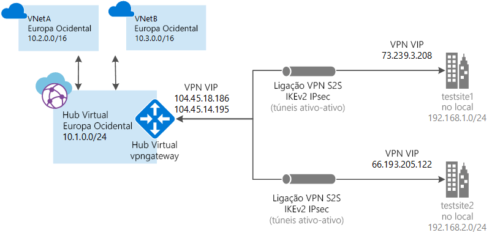

# <a name="tutorial-create-a-site-to-site-connection-using-azure-virtual-wan"></a>Tutorial: Criar uma ligação site a site com a WAN Virtual do Azure

Este tutorial mostra-lhe como utilizar a WAN Virtual para se ligar aos seus recursos no Azure através de uma ligação VPN IPsec/IKE (IKEv1 e IKEv2). Este tipo de ligação requer um dispositivo VPN localizado no local que tenha um endereço IP público com acesso exterior atribuído ao mesmo. Para obter mais informações sobre a WAN Virtual, veja [Virtual WAN Overview](virtual-wan-about.md) (Descrição Geral da WAN Virtual)

> [!NOTE]
> Se tiver muitos sites, teria de utilizar, normalmente, um [parceiro de WAN Virtual](https://aka.ms/virtualwan) para criar esta configuração. Contudo, pode criá-la sozinho se se sentir à vontade com o trabalho em rede e souber configurar o seu próprio dispositivo VPN.
>



Neste tutorial, ficará a saber como:

> [!div class="checklist"]
> * Criar uma WAN
> * Criar um site
> * Criar um hub
> * Ligar um hub a um site
> * Ligar uma VNet a um hub
> * Transferir e aplicar a configuração do dispositivo VPN
> * Ver a WAN Virtual
> * Ver o estados de funcionamento dos recursos
> * Monitorizar uma ligação

## <a name="before-you-begin"></a>Antes de começar

[!INCLUDE [Before you begin](../../includes/virtual-wan-tutorial-vwan-before-include.md)]

## <a name="vnet"></a>1. Criar uma rede virtual

[!INCLUDE [Create a virtual network](../../includes/virtual-wan-tutorial-vnet-include.md)]

## <a name="openvwan"></a>2. Criar uma WAN Virtual

Num browser, navegue para o [Portal do Azure](https://portal.azure.com) e inicie sessão com a sua conta do Azure.

[!INCLUDE [Create a virtual WAN](../../includes/virtual-wan-tutorial-vwan-include.md)]

## <a name="site"></a>3. Criar um site

Crie tantos sites qantos necessários para corresponder às suas localizações físicas. Por exemplo, se tiver uma sucursal em Nova Iorque, uma em Londres e outra em Lisboa, tem de criar três sites separados. Esses sites contêm os pontos finais dos seus dispositivos VPN no local. Neste momento, só pode especificar um espaço de endereços privado para o site.

1. Clique no WAN que criou. Na página de WAN, em **Arquitetura de WAN**, clique em **Sites de VPN** para abrir a página de sites de VPN.
2. Na página **Sites de VPN**, clique em **+Criar site**.
3. Na página **Criar site**, preencha os seguintes campos:

  * **Name** (Nome) - é o nome pelo qual se quer referir ao site no local.
  * **Public IP address** (endereço IP público) - é o endereço IP público do dispositivo VPN que reside no site no local.
  * **Private address space** (espaço de endereços privados) - é o espaço de endereços IP que está localizado no site no local. O tráfego destinado a este espaço de endereços é encaminhado para o site local.
  * **Subscription** (Subscrição) - verifique a subscrição.
  * **Resource Group** (Grupo de Recursos) - o grupo de recursos que quer utilizar.
  * **Localização**.
4. Clique em **Mostrar avançadas** para ver mais definições. Pode selecionar **BGP** para ativar o BGP, o que ativará esta funcionalidade em todas as ligações criadas para este site no Azure. Também pode introduzir **Informações do dispositivo** (campos opcionais). Essas informações podem ajudar a Equipa do Azure a compreender melhor o seu ambiente de modo a acrescentar possibilidades de otimização adicionais no futuro ou a ajudá-lo a resolver problemas.
5. Clique em **Confirmar**.
6. Depois de clicar em **Confirmar**, veja o estado na página de sites de VPN. O site será alterado de **A aprovisionar** para **Aprovisionado**.

## <a name="hub"></a>4. Criar um hub

[!INCLUDE [Create a virtual WAN](../../includes/virtual-wan-tutorial-hub-include.md)]

## <a name="associate"></a>5. Associar os sites ao hub

Os hubs geralmente são associados a sites que estão na mesma região onde se encontra a VNet.

1. Na página **Sites de VPN**, selecione o site ou sites a que pretende associar o hub e, em seguida, clique em **+Nova associação do hub**.
2. Na página **Associar sites a um ou mais hubs**, selecione um hub na lista pendente. Pode associar um site aos hubs adicionais ao clicar em **+Adicionar uma associação**.
3. Também pode adicionar um **PSK** específico aqui ou utilizar a predefinição.
4. Clique em **Confirmar**.
5. Pode ver o estado da ligação na página **sites de VPN**.

## <a name="vnet"></a>6. Ligar a VNet a um hub

Neste passo, vai criar a ligação de peering entre o hub e uma VNet. Repita estes passos para cada VNet que queira ligar.

1. Na página da WAN virtual, clique em **Ligações de rede virtual**.
2. Na página de ligação da rede virtual, clique em **+Add connection** (+Adicionar ligação).
3. Na página **Add connection** (Adicionar ligação), preencha os seguintes campos:

    * **Connection name** (Nome da ligação) - dê um nome à ligação.
    * **Hubs** - selecione o hub que pretende associar a esta ligação.
    * **Subscription** (Subscrição) - verifique a subscrição.
    * **Virtual network** (Rede virtual) - selecione a rede virtual que pretende ligar a este hub. A rede virtual não pode ter um gateway de rede virtual já existente.
4. Clique em **OK** para criar a ligação de peering.

## <a name="device"></a>7. Transferir a configuração da VPN

Utilize a configuração do dispositivo VPN para configurar o seu dispositivo VPN no local.

1. Na página da WAN virtual, clique em **Overview** (Descrição geral).
2. Na parte superior da página Overview, clique em **Download VPN configuration** (Transferir configuração da VPN). O Azure cria uma conta de armazenamento no grupo de recursos “microsoft-network-[localização]”, em que “localização” é a localização da WAN. Depois de aplicar a configuração aos dispositivos VPN, pode eliminar esta conta de armazenamento.
3. Após a conclusão da criação do ficheiro, pode clicar na ligação para transferi-lo.
4. Aplique a configuração ao dispositivo VPN.

### <a name="understanding-the-vpn-device-configuration-file"></a>Compreender o ficheiro de configuração do dispositivo VPN

O ficheiro de configuração do dispositivo contém as definições que vão ser utilizadas para configurar o dispositivo VPN no local. Quando vir este ficheiro, repare nas informações seguintes:

* **vpnSiteConfiguration -** esta secção mostra os detalhes do dispositivo configurados como site que se vai ligar à WAN virtual. Inclui o nome e o endereço IP público do dispositivo da sucursal.
* **vpnSiteConnections -** esta secção disponibiliza informações sobre o seguinte:

    * **Espaço de endereços** da VNet do hub ou hubs virtuais.<br>Exemplo:
 
        ```
        "AddressSpace":"10.1.0.0/24"
        ```
    * **Espaço de endereços** das VNets que estão ligadas ao hub<br>Exemplo:

         ```
        "ConnectedSubnets":["10.2.0.0/16","10.30.0.0/16"]
         ```
    * **Endereços IP** do vpngateway do hub virtual. Uma vez que o vpngateway tem ambas as ligações compostas por dois túneis na configuração ativo-ativo, verá os dois endereços IP indicados neste ficheiro. Neste exemplo, vê "Instance0" e "Instance1" para cada site.<br>Exemplo:

        ``` 
        "Instance0":"104.45.18.186"
        "Instance1":"104.45.13.195"
        ```
    * **Detalhes da configuração da ligação Vpngateway**, como BGP, chave pré-partilhada, etc. O PSK é a chave pré-partilhada que é gerada automaticamente para si. Pode sempre editar a ligação na página Overview (Descrição geral) de um PSK personalizado.
  
### <a name="example-device-configuration-file"></a>Exemplo de ficheiro de configuração de dispositivo

  ```
  { 
      "configurationVersion":{ 
         "LastUpdatedTime":"2018-07-03T18:29:49.8405161Z",
         "Version":"r403583d-9c82-4cb8-8570-1cbbcd9983b5"
      },
      "vpnSiteConfiguration":{ 
         "Name":"testsite1",
         "IPAddress":"73.239.3.208"
      },
      "vpnSiteConnections":[ 
         { 
            "hubConfiguration":{ 
               "AddressSpace":"10.1.0.0/24",
               "Region":"West Europe",
               "ConnectedSubnets":[ 
                  "10.2.0.0/16",
                  "10.30.0.0/16"
               ]
            },
            "gatewayConfiguration":{ 
               "IpAddresses":{ 
                  "Instance0":"104.45.18.186",
                  "Instance1":"104.45.13.195"
               }
            },
            "connectionConfiguration":{ 
               "IsBgpEnabled":false,
               "PSK":"bkOWe5dPPqkx0DfFE3tyuP7y3oYqAEbI",
               "IPsecParameters":{ 
                  "SADataSizeInKilobytes":102400000,
                  "SALifeTimeInSeconds":3600
               }
            }
         }
      ]
   },
   { 
      "configurationVersion":{ 
         "LastUpdatedTime":"2018-07-03T18:29:49.8405161Z",
         "Version":"1f33f891-e1ab-42b8-8d8c-c024d337bcac"
      },
      "vpnSiteConfiguration":{ 
         "Name":" testsite2",
         "IPAddress":"66.193.205.122"
      },
      "vpnSiteConnections":[ 
         { 
            "hubConfiguration":{ 
               "AddressSpace":"10.1.0.0/24",
               "Region":"West Europe"
            },
            "gatewayConfiguration":{ 
               "IpAddresses":{ 
                  "Instance0":"104.45.18.187",
                  "Instance1":"104.45.13.195"
               }
            },
            "connectionConfiguration":{ 
               "IsBgpEnabled":false,
               "PSK":"XzODPyAYQqFs4ai9WzrJour0qLzeg7Qg",
               "IPsecParameters":{ 
                  "SADataSizeInKilobytes":102400000,
                  "SALifeTimeInSeconds":3600
               }
            }
         }
      ]
   },
   { 
      "configurationVersion":{ 
         "LastUpdatedTime":"2018-07-03T18:29:49.8405161Z",
         "Version":"cd1e4a23-96bd-43a9-93b5-b51c2a945c7"
      },
      "vpnSiteConfiguration":{ 
         "Name":" testsite3",
         "IPAddress":"182.71.123.228"
      },
      "vpnSiteConnections":[ 
         { 
            "hubConfiguration":{ 
               "AddressSpace":"10.1.0.0/24",
               "Region":"West Europe"
            },
            "gatewayConfiguration":{ 
               "IpAddresses":{ 
                  "Instance0":"104.45.18.187",
                  "Instance1":"104.45.13.195"
               }
            },
            "connectionConfiguration":{ 
               "IsBgpEnabled":false,
               "PSK":"YLkSdSYd4wjjEThR3aIxaXaqNdxUwSo9",
               "IPsecParameters":{ 
                  "SADataSizeInKilobytes":102400000,
                  "SALifeTimeInSeconds":3600
               }
            }
         }
      ]
   }
  ```

### <a name="configuring-your-vpn-device"></a>Configurar o dispositivo VPN

>[!NOTE]
> Se está a trabalhar com uma solução de parceiros do WAN Virtual, a configuração do dispositivo VPN acontece automaticamente. O controlador de dispositivo obtém o ficheiro de configuração do Azure e aplica o dispositivo para configurar a ligação ao Azure. Isto significa que não é preciso saber como configurar o dispositivo VPN manualmente.
>

Se precisar de instruções para configurar o dispositivo, pode utilizar as instruções na [página VPN device configuration scripts](~/articles/vpn-gateway/vpn-gateway-about-vpn-devices.md#configscripts) (Scripts de configuração de dispositivos VPN), tendo em conta os seguintes avisos:

* As instruções a página de dispositivos VPN não foram escritas para a WAN Virtual, mas pode utilizar os valores desta a partir do ficheiro de configuração para configurar o seu dispositivo VPN manualmente. 
* Os scripts de configuração do dispositivo transferíveis que se destinam ao Gateway de VPN não funcionam para a WAN Virtual, uma vez que a configuração é diferente.
* Uma WAN Virtual Novo pode suportar o IKEv1 e o IKEv2.
* A WAN Virtual só pode utilizar dispositivos VPN baseados em rotas e instruções do dispositivo.

## <a name="viewwan"></a>8. Ver a WAN Virtual

1. Navegue para a WAN virtual.
2. Na página Overview, cada ponto no mapa representa um hub. Coloque o cursor sobre um ponto para ver o resumo do estado de funcionamento do hub.
3. Na secção Hubs e ligações, pode ver o estado do hub, o site, a região, o estado da ligação VPN e os bytes de entrada e saída.

## <a name="viewhealth"></a>9. Ver o estado de funcionamento do seu recurso

1. Navegue para a WAN.
2. Na página WAN, na secção **SUPPORT + Troubleshooting** (SUPORTE + Resolução de Problemas), clique em **Health** (Estado de funcionamento) e veja o recurso.

## <a name="connectmon"></a>10. Monitorizar uma ligação

Crie uma ligação para monitorizar a comunicação entre uma VM do Azure e um site remoto. Para obter informações sobre como configurar um monitor de ligação, veja [Monitorizar a comunicação de rede](~/articles/network-watcher/connection-monitor.md). O campo de origem é o IP da VM no Azure e o IP de destino é o IP do site.

## <a name="cleanup"></a>11. Limpar recursos

Quando já não precisar desses recursos, pode utilizar [Remove-AzureRmResourceGroup](/powershell/module/azurerm.resources/remove-azurermresourcegroup) para remover o grupo de recursos e todos os recursos que o mesmo contém. Substitua "myResourceGroup" pelo nome do grupo de recursos e execute o seguinte comando do PowerShell:

```azurepowershell-interactive
Remove-AzureRmResourceGroup -Name myResourceGroup -Force
```

## <a name="next-steps"></a>Passos seguintes

Neste tutorial, ficou a saber como:

> [!div class="checklist"]
> * Criar uma WAN
> * Criar um site
> * Criar um hub
> * Ligar um hub a um site
> * Ligar uma VNet a um hub
> * Transferir e aplicar a configuração do dispositivo VPN
> * Ver a WAN Virtual
> * Ver o estados de funcionamento dos recursos
> * Monitorizar uma ligação

Para saber mais sobre a WAN Virtual, veja a página [Virtual WAN Overview](virtual-wan-about.md) (Descrição Geral da WAN Virtual).
