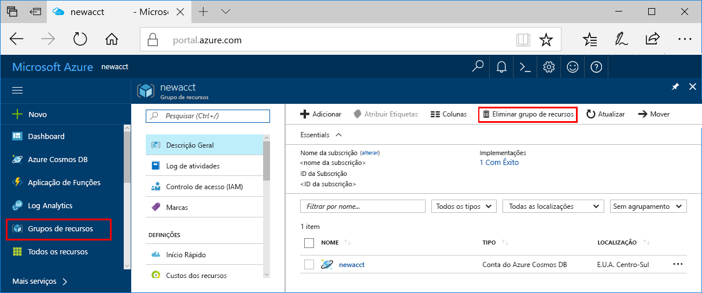

>[!IMPORTANT]
>Os recursos que criou podem ser utilizados como pré-requisitos para outros tutoriais e artigos de procedimentos do serviço do Azure Machine Learning. 

Se não pretende utilizar os recursos que foram criados, elimine-os para não incorrer em custos.

1. No portal do Azure, selecione **Grupos de recursos** na extremidade esquerda.
 
   

1. Na lista, selecione o grupo de recursos que criou.

1. Selecione **Eliminar grupo de recursos**.

1. Introduza o nome do grupo de recursos e selecione **Eliminar**.

   Se vir a mensagem de erro "Não pode eliminar o recurso antes de os recursos aninhados serem eliminados", tem de eliminar os eventuais recursos aninhados primeiro. Para obter informações sobre como eliminar recursos aninhados, veja [esta secção de resolução de problemas](../articles/machine-learning/desktop-workbench/known-issues-and-troubleshooting-guide.md#cant-delete-experimentation-account). 
