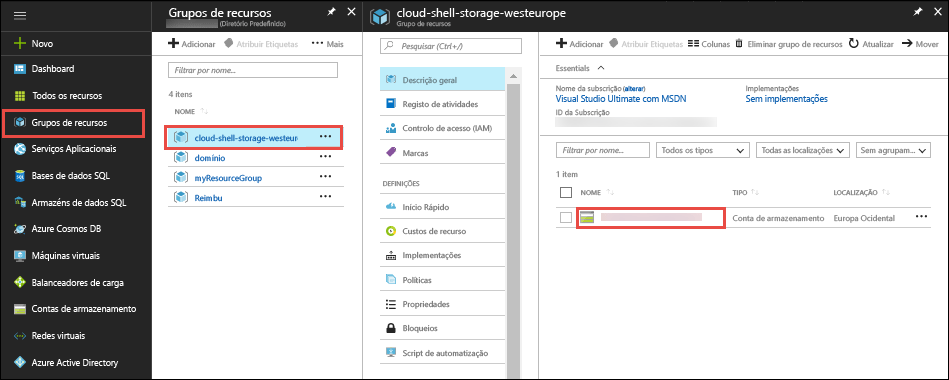
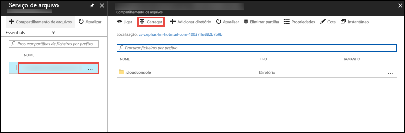

No [portal do Azure](https://portal.azure.com), clique em **grupos de recursos** > **nuvem-shell-storage -\<your_region >**  >   **\<storage_account_name >**.



No **descrição geral** página da conta de armazenamento, selecione **ficheiros**.

Selecione a partilha de ficheiros gerado automaticamente e selecione **carregar**. Esta partilha de ficheiros está montada na Shell do Cloud como `clouddrive`.



O Seletor de ficheiros e selecione o ficheiro ZIP, clique em **carregar**. 

A Shell de nuvem, utilizar `ls` para verificar se pode ver o ficheiro ZIP carregado predefinida `clouddrive` partilhar.

```azurecli-interactive
ls clouddrive
```
