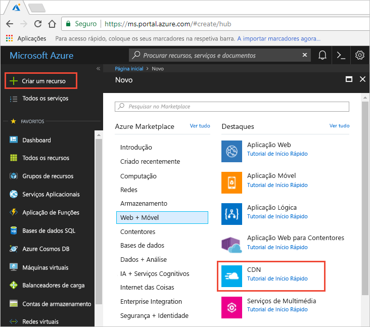
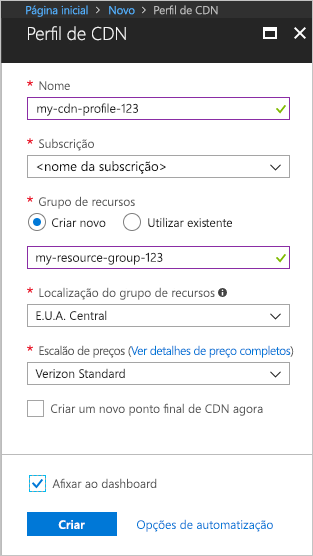

## Criar um novo perfil da CDN

Um perfil da CDN é um contentor de pontos finais da CDN e especifica um escalão de preço.

1. No portal do Azure, no canto superior esquerdo, selecione **crie um recurso**.
    
    O **novo** painel aparece.
   
2. Selecione **Web + móvel**, em seguida, **CDN**.
   
    

    O **perfil da CDN** painel aparece.

    Utilize as definições especificadas na tabela a seguir a imagem.
   
    

    | Definição  | Valor |
    | -------- | ----- |
    | **Nome** | Introduza *my-cdn-perfil-123* para o nome do perfil. Este nome deve ser globalmente exclusivo; Se já se encontra em utilização, pode introduzir uma diferente. |
    | **Subscrição** | Selecione uma subscrição do Azure a partir da lista pendente.|
    | **Grupo de recursos** | Selecione **criar nova** e introduza *my-resource-grupo-123* para o nome do grupo de recursos. Este nome deve ser globalmente exclusivo; Se já se encontra em utilização, pode introduzir uma diferente. | 
    | **Localização do grupo de recursos** | Selecione **EUA Central** na lista pendente. |
    | **Escalão de preço** | Selecione **Standard da Verizon** na lista pendente. |
    | **Criar um novo ponto final da CDN agora** | Deixe não seleccionado. |  
   
3. Selecione **afixar ao dashboard** para guardar o perfil ao seu dashboard depois de criado.
    
4. Selecione **criar** para criar o perfil. 

