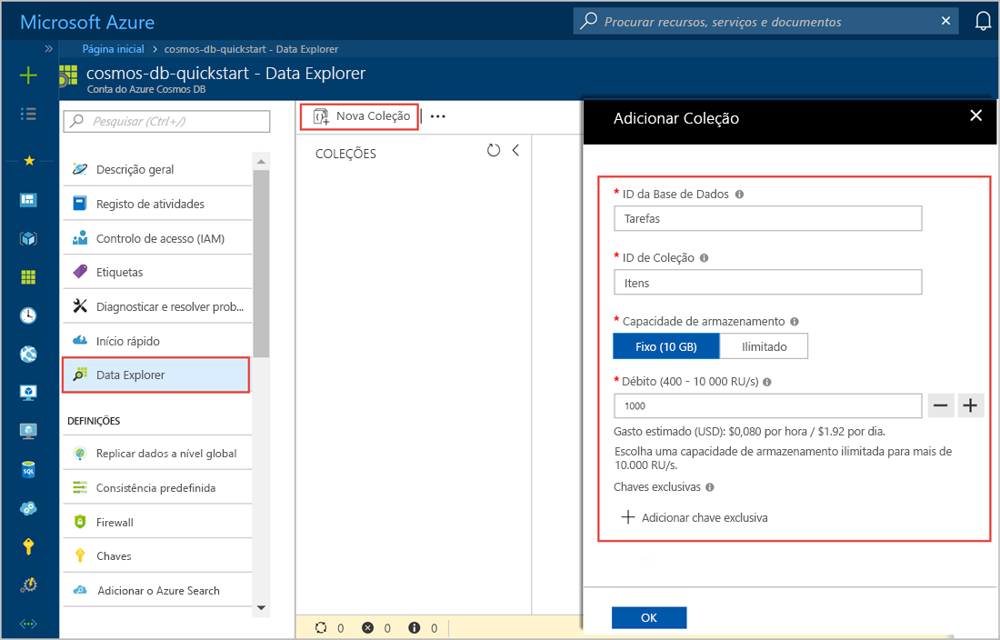
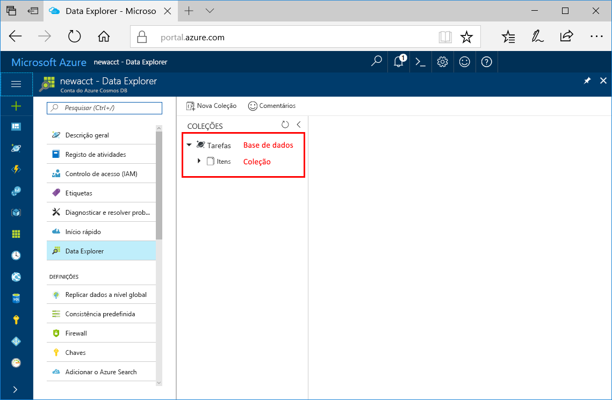

Agora, pode utilizar a ferramenta Data Explorer no portal do Azure para criar uma base de dados e uma coleção. 

1. Clique em **Explorador de Dados** > **Nova Coleção**. 
    
    A área **Adicionar Coleção** é apresentada na extremidade direita, pelo que poderá ter de se deslocar para a direita para vê-la.

    

2. Na página **Adicionar coleção**, introduza as definições para a nova coleção.

    Definição|Valor sugerido|Descrição
    ---|---|---
    Id da base de dados|Tarefas|Designe a nova base de dados como *Tarefas*. Os nomes das bases de dados devem conter de 1 a 255 carateres e não podem conter /, \\, #, ?, ou um espaço à direita.
    ID da coleção|Itens|Denomine a nova coleção como *Itens*. Os IDs das coleções têm os mesmos requisitos em termos de carateres do que os nomes das bases de dados.
    Capacidade de armazenamento| Fixa (10 GB)|Deixe o valor predefinido de **Fixa (10 GB)**. Este valor é a capacidade de armazenamento da base de dados.
    Débito|400 RU|Altere o débito para 400 unidades de pedido por segundo (RU/s). A capacidade de armazenamento tem de ser definida como **Fixo (10 GB)**, para definir o débito para 400 RU/s. Se pretender reduzir a latência, pode aumentar o débito mais tarde. 
    
    Além das definições anteriores, pode adicionar opcionalmente **Chaves exclusivas** para a coleção. Vamos deixar o campo vazio neste exemplo. As chaves exclusivas oferecem aos programadores a capacidade de adicionar uma camada de integridade dos dados na base de dados. Ao criar uma política de chaves exclusivas durante a criação de uma coleção, está a assegurar a exclusividade de um ou mais valores por chave de partição. Para saber mais, consulte o artigo [Chaves exclusivas no Azure Cosmos DB](../articles/cosmos-db/unique-keys.md).
    
    Clique em **OK**.

    O Data Explorer mostra a base de dados e a coleção novas.

    