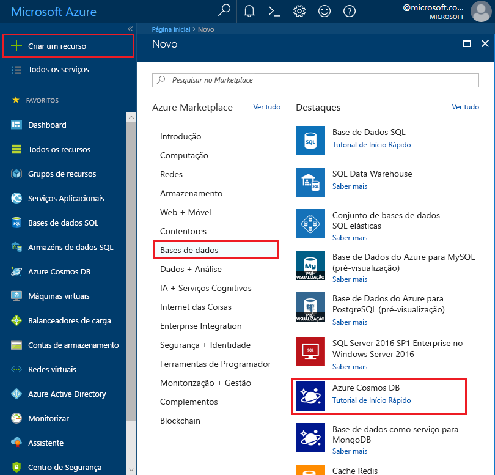
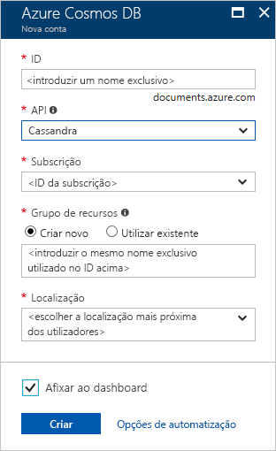

1. Numa nova janela do browser, inicie sessão no [portal do Azure](https://portal.azure.com/).
2. Clique em **Criar um recurso** > **Bases de dados** > **Azure Cosmos DB**.
   
   

3. Na página **Nova conta**, introduza as definições para a nova conta do Azure Cosmos DB. 
 
    Definição|Valor sugerido|Descrição
    ---|---|---
    ID|*Introduzir um nome exclusivo*|Introduza um nome exclusivo para identificar esta conta do Azure Cosmos DB. Uma vez que *cassandra.cosmosdb.azure.com* é anexado ao ID que indica para criar o seu ponto de contacto, utilize um ID exclusivo, mas identificável.  O ID pode conter apenas minúsculas, números, o caráter hífen (-) e tem de ter entre 3 e 50 carateres.
    API|Cassandra|A API determina o tipo de conta a criar. O Azure do Cosmos DB oferece cinco APIs que se adequam às necessidades da sua aplicação: SQL Server (base de dados do documento), Gremlin (base de dados do gráfico), MongoDB (base de dados do documento), Tabela do Azure e Cassandra, cada qual necessita atualmente de uma conta separada.   Selecione **Cassandra** porque neste início rápido está a criar uma base de dados de coluna ampla que é consultável com a sintaxe CQL.  Se o Cassandra (coluna ampla) não aparecer na sua lista, então tem de [pedir para participar](../articles/cosmos-db/cassandra-introduction.md#sign-up-now) no programa de pré-visualização da API Cassandra.   [Saiba mais sobre a API Cassandra](../articles/cosmos-db/cassandra-introduction.md)|
    Subscrição|*A sua subscrição*|Selecione a subscrição do Azure que quer utilizar para esta conta do Azure Cosmos DB. 
    Grupo de Recursos|Criar novo  *Em seguida, introduza o mesmo nome exclusivo, conforme indicado no ID acima*|Selecione **Criar Novo** e, em seguida, introduza um novo nome de grupo de recursos para a sua conta. Para simplicidade, pode utilizar o mesmo nome do ID. 
    Localização|*Selecione a região mais próxima dos seus utilizadores*|Selecione a localização geográfica na qual vai alojar a sua conta do Azure Cosmos DB. Utilize a localização mais próxima dos seus utilizadores para lhes dar o acesso mais rápido aos dados.
    Afixar ao dashboard | Selecione | Selecione esta caixa para que a sua nova conta da base de dados seja adicionada ao dashboard do portal para facilitar o acesso.

    Em seguida, clique em **Criar**.

    

4. A criação da conta demora alguns minutos. Aguarde que o portal apresente a página **Parabéns! A sua conta do Azure Cosmos DB foi criada**.

