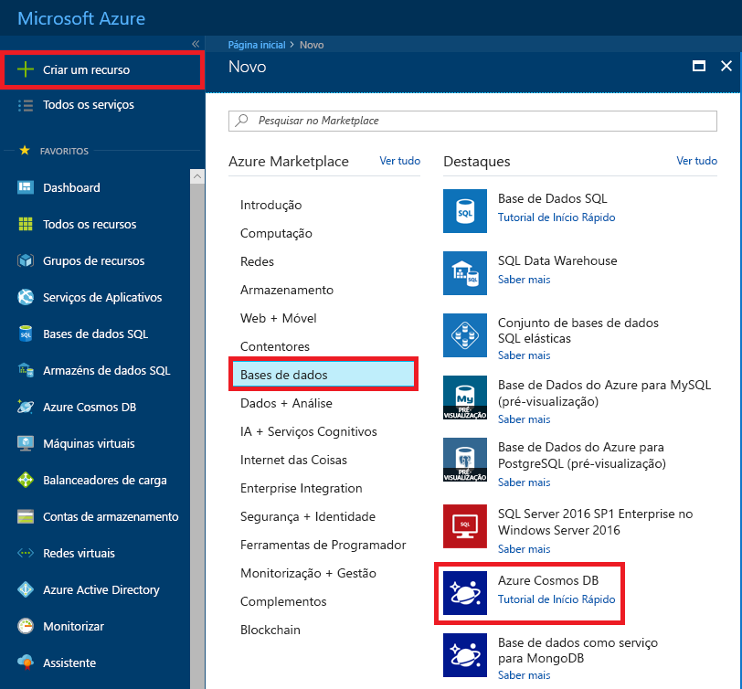
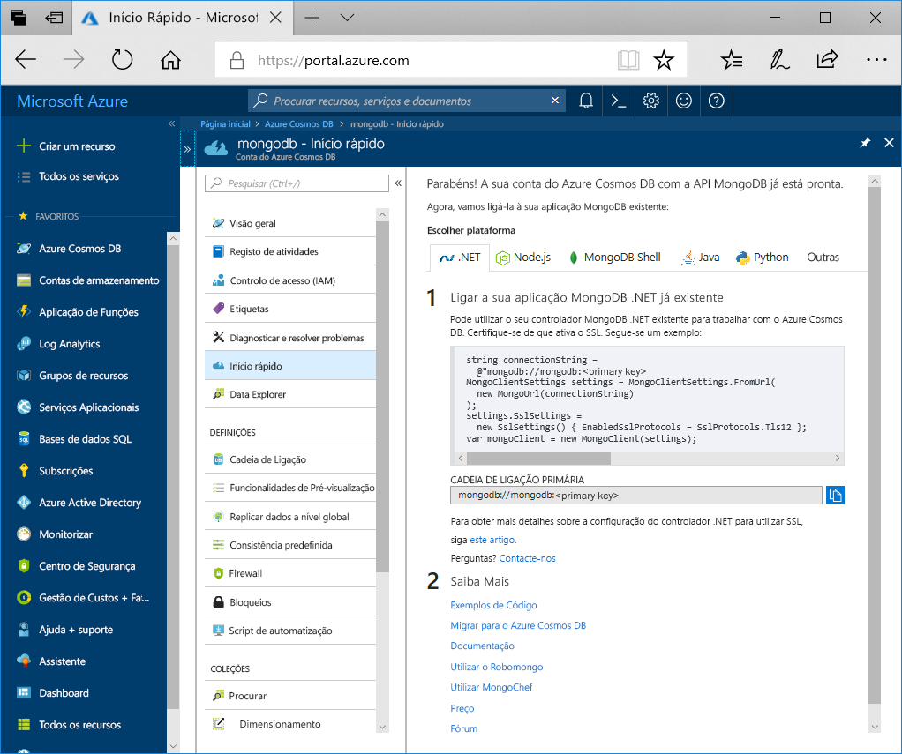

1. Numa nova janela, inicie sessão no [portal do Azure](https://portal.azure.com/).
2. No menu esquerdo, clique em **Criar um recurso**, **Bases de Dados**e, em **Azure Cosmos DB** e **Criar**.
   
   

3. Na **criar o Azure Cosmos DB conta** página, introduza as definições para a nova conta do Azure Cosmos DB. 
 
    Definição|Valor|Descrição
    ---|---|---
    Subscrição|A sua subscrição|Selecione a subscrição do Azure que quer utilizar para esta conta do Azure Cosmos DB. 
    Grupo de Recursos|Criar novo  Em seguida, introduza o mesmo nome exclusivo, conforme indicado na ID|Selecione **Criar novo**. Em seguida, introduza um nome de grupo de recursos novo para a sua conta. Para manter a simplicidade, utilize o mesmo nome do ID. 
    Nome da Conta|Introduza um nome exclusivo|Introduza um nome exclusivo para identificar a sua conta do Azure Cosmos DB. Uma vez que *documents.azure.com* é anexado ao ID que indicar para criar o seu URI, utilize um ID exclusivo.  O ID pode utilizar apenas letras minúsculas, números e o caráter de hífen (-). Tem de ter entre 3 a 31 carateres de comprimento.
    API|API do Azure Cosmos DB para MongoDB|A API determina o tipo de conta a criar. O Azure Cosmos DB oferece cinco APIs: Núcleo (SQL) para bases de dados de documento, Gremlin para bases de dados do gráfico, MongoDB de API do Azure Cosmos DB para bases de dados de documentos, tabelas do Azure e Cassandra. Atualmente, tem de criar uma conta separada para cada API.   Selecione **MongoDB** porque neste início rápido está a criar uma tabela que funciona com o MongoDB.|
    Localização|Selecione a região mais próxima dos seus utilizadores|Selecione a localização geográfica para alojar a sua conta do Azure Cosmos DB. Utilize a localização mais próxima dos seus utilizadores para lhes dar o acesso mais rápido aos dados.

    Selecione **rever + criar**. Pode ignorar o **rede** e **etiquetas** secção. 

    

4. A criação da conta demora alguns minutos. Aguarde que o portal apresente a página **Parabéns! Sua conta do Cosmos com a compatibilidade de protocolo de transmissão do MongoDB está pronta** página.

    
