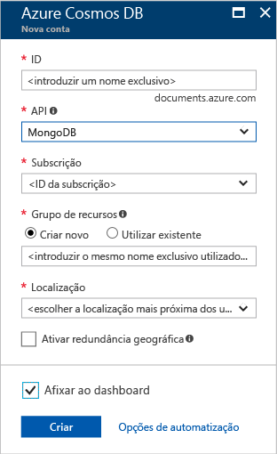
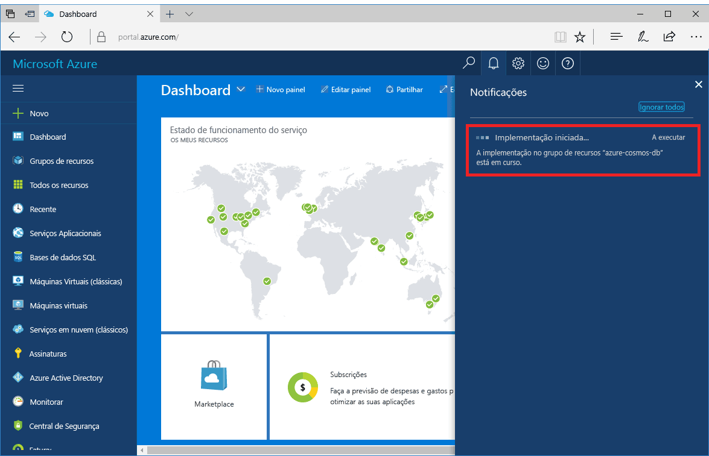
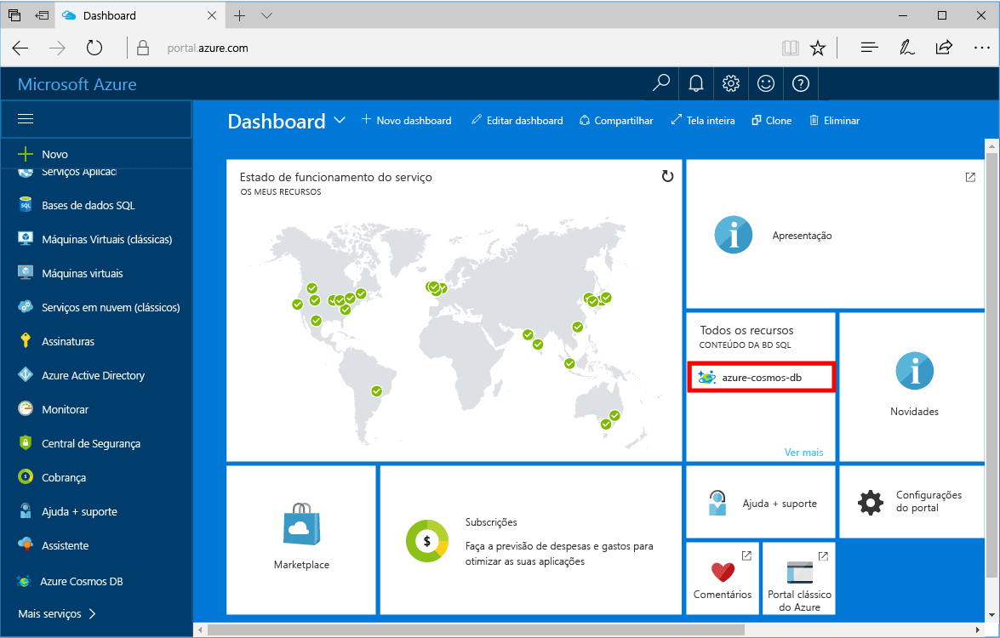

1. Numa nova janela, inicie sessão no [portal do Azure](https://portal.azure.com/).
2. No menu esquerdo, clique em **Criar um recurso**, **Bases de Dados**e, em **Azure Cosmos DB** e **Criar**.
   
   

3. No painel **Nova conta**, especifique **MongoDB** como a API e preencha a configuração pretendida para a conta do Azure Cosmos DB.
 
    

    * O **ID** tem de ser um nome exclusivo que vai utilizar para identificar a sua conta do Azure Cosmos DB. Pode conter apenas minúsculas, números, o caráter "-" e tem de ter entre três e 50 carateres.
    * A **Subscrição** é a sua subscrição do Azure. Será preenchida para si.
    * O **Grupo de Recursos** é o nome do grupo de recursos para a sua conta do Azure Cosmos DB.
    * A **Localização** é a localização geográfica onde está localizada a sua instância da instância do Azure Cosmos DB. Escolha a localização mais próxima dos seus utilizadores.

4. Clique em **Criar** para criar a conta.
5. Na barra de ferramentas, clique em **Notificações** para monitorizar o processo de implementação.

    

6.  Quando a implementação estiver concluída, abra a conta nova no mosaico Todos os Recursos. 

    
