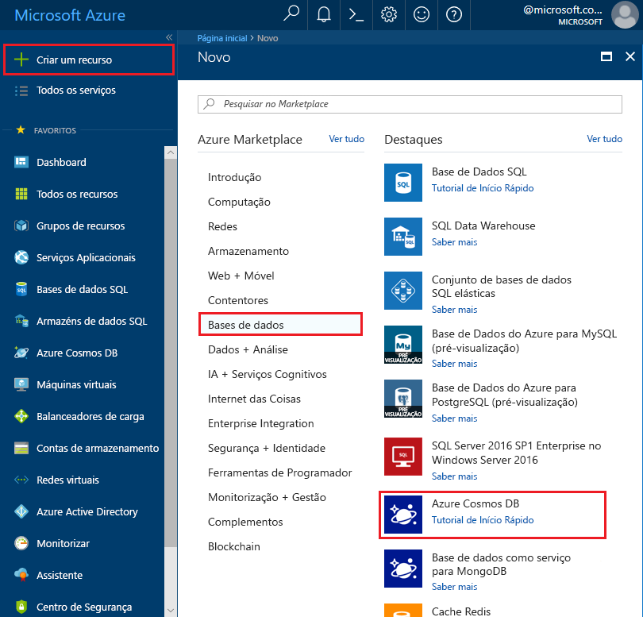
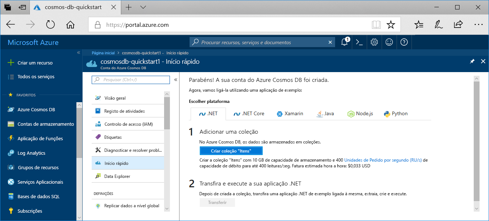

1. Numa nova janela do browser, inicie sessão no [portal do Azure](https://portal.azure.com/).
2. Clique em **Criar um recurso** > **Bases de dados** > **Azure Cosmos DB**.
   
   

3. Na **criar o Azure Cosmos DB conta** página, introduza as definições para a nova conta do Azure Cosmos DB. 
 
    Definição|Valor|Descrição
    ---|---|---
    Subscrição|*A sua subscrição*|Selecione a subscrição do Azure que quer utilizar para esta conta do Azure Cosmos DB. 
    Grupo de Recursos|Criar novo  *Introduzir um nome exclusivo*|Selecione **Criar Novo** e, em seguida, introduza um novo nome de grupo de recursos para a sua conta. Para simplificar, pode utilizar o mesmo nome como nome da sua conta. 
    Nome da Conta|*Introduzir um nome exclusivo*|Introduza um nome exclusivo para identificar a sua conta do Azure Cosmos DB. Uma vez que *documents.azure.com* é anexado ao ID que indicar para criar o seu URI, utilize um ID exclusivo.  O ID pode conter apenas minúsculas, números, o caráter hífen (-) e tem de ter entre 3 e 50 carateres.
    API|Núcleo (SQL)|A API determina o tipo de conta a criar. O Azure Cosmos DB oferece cinco APIs: SQL (base de dados de documentos), Gremlin (base de dados de gráficos), MongoDB (base de dados de documentos), API de Tabela e API para Cassandra. Atualmente, cada uma das APIs exige que crie uma conta separada.   Selecione **Core (SQL)** porque este artigo irá criar uma base de dados de documentos e consultas com sintaxe SQL.   [Saiba mais sobre a API SQL](../articles/cosmos-db/documentdb-introduction.md)|
    Localização|*Selecione a região mais próxima dos seus utilizadores*|Selecione a localização geográfica para alojar a sua conta do Azure Cosmos DB. Utilize a localização mais próxima dos seus utilizadores para lhes dar o acesso mais rápido aos dados.
    Ativar redundância geográfica| Deixar em branco | Esta ação cria uma versão replicada da base de dados numa segunda região (emparelhada). Deixe em branco.  
    Escritas de várias regiões| Deixar em branco | Isto permite que cada uma das suas regiões de base de dados para ser de leitura e a região de escrita. Deixe em branco.  

    Em seguida, clique em **Rever + criar**. Pode ignorar o **rede** e **etiquetas** secção. 

    

    Reveja as informações de resumo e clique em **criar**. 

    

4. A criação da conta demora alguns minutos. Aguarde que o portal apresentar os **a implementação estiver concluída** da mensagem e clique em **Ir para recurso**.     

    

5. O portal apresenta o **Parabéns! A sua conta do Azure Cosmos DB foi criada**.

    

