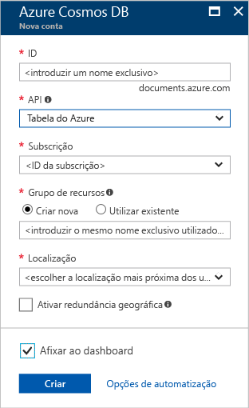

1. Numa nova janela do browser, inicie sessão no [portal do Azure](https://portal.azure.com/).
2. No menu esquerdo, clique em **Criar um recurso**, **Bases de Dados**e, em **Azure Cosmos DB** e **Criar**. 
   
   

3. Na página **Nova conta**, introduza as definições para a nova conta do Azure Cosmos DB. 
 
    Definição|Valor sugerido|Descrição
    ---|---|---
    ID|*Introduzir um nome exclusivo*|Introduza um nome exclusivo para identificar esta conta do Azure Cosmos DB. Uma vez que *documents.azure.com* é anexado ao ID que indicar para criar o seu URI, utilize um ID exclusivo, mas identificável.  O ID pode conter apenas minúsculas, números, o caráter hífen (-) e tem de ter entre 3 e 50 carateres.
    API|Tabela do Azure|A API determina o tipo de conta a criar. O Azure do Cosmos DB oferece cinco APIs que se adequam às necessidades da sua aplicação: SQL Server (base de dados do documento), Gremlin (base de dados do gráfico), MongoDB (base de dados do documento), Tabela do Azure e Cassandra, cada qual necessita atualmente de uma conta separada.  Selecione **Tabela do Azure** porque neste início rápido está a criar uma tabela que funciona com a API da Tabela.  [Saber mais sobre a API da Tabela](../articles/cosmos-db/table-introduction.md) |
    Subscrição|*Introduzir o mesmo nome exclusivo, conforme indicado no ID acima*|Selecione a subscrição do Azure que quer utilizar para esta conta do Azure Cosmos DB. 
    Grupo de Recursos|*O mesmo valor que o ID*|Introduza um novo nome do grupo de recursos para a sua conta. Para simplicidade, pode utilizar o mesmo nome do ID. 
    Localização|*Selecione a região mais próxima dos seus utilizadores*|Selecione a localização geográfica na qual vai alojar a sua conta do Azure Cosmos DB. Utilize a localização mais próxima dos seus utilizadores para lhes dar o acesso mais rápido aos dados.
    Ativar redundância geográfica| Deixar em branco | Esta ação cria uma versão replicada da base de dados numa segunda região (emparelhada). Deixe em branco.  
    Afixar ao dashboard | Selecione | Selecione esta caixa para que a sua nova conta da base de dados seja adicionada ao dashboard do portal para facilitar o acesso.

    Em seguida, clique em **Criar**.  

    

4. A criação da conta demora alguns minutos. Durante a criação da conta, o portal apresenta o mosaico **Implementar Azure Cosmos DB**.

    

    Assim que a conta é criada, é apresentada a página **Parabéns! A sua conta do Azure Cosmos DB foi criada**.
