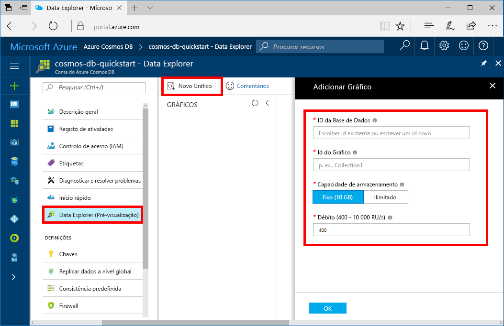

Agora, pode utilizar a ferramenta Data Explorer no portal do Azure para criar uma base de dados de gráfico. 

1. No portal do Azure, no menu à esquerda, selecione **Explorador de dados (pré-visualização)**.

2. Em **Explorador de dados (pré-visualização)**, selecione **gráfico novo**. Em seguida, preencha a página utilizando as seguintes informações:

    

    Definição|Valor sugerido|Descrição
    ---|---|---
    Id da base de dados|base de dados de exemplo|Designe a nova base de dados como *sample-database*. Os nomes de base de dados tem de estar entre 1 e 255 carateres e não pode conter `/ \ # ?` ou um espaço à direita.
    ID do gráfico|gráfico de exemplo|Denomine a nova coleção como *sample-graph*. Os nomes dos gráficos têm os mesmos requisitos de carateres que os IDs das bases de dados.
    Capacidade de armazenamento| 10 GB|Deixe o valor predefinido. Esta é a capacidade de armazenamento da base de dados.
    Débito|400 RUs|Deixe o valor predefinido. Pode aumentar verticalmente o débito mais tarde, se quiser reduzir a latência.

3. Depois do formulário é preenchido, selecione **OK**.
