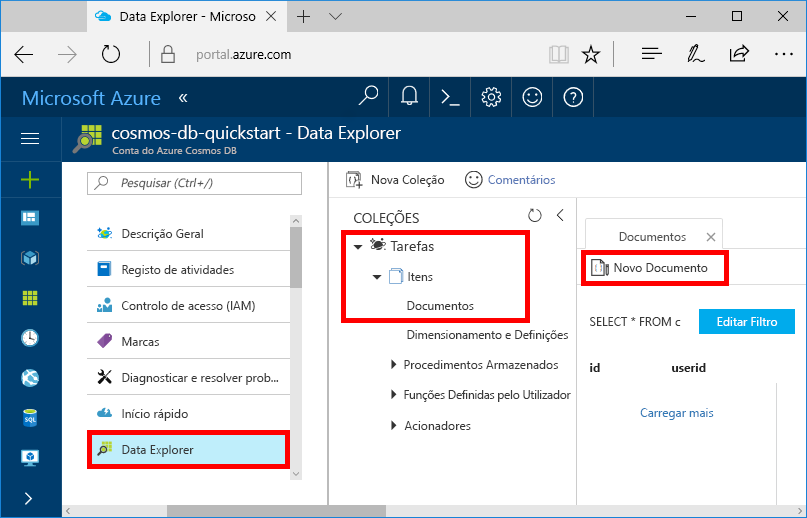
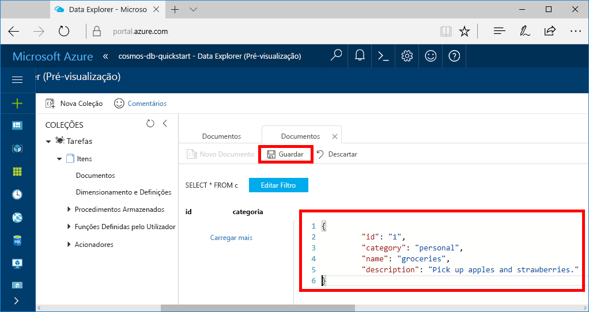

Pode agora utilizar o Data Explorer para adicionar dados à sua coleção nova.

1. No Data Explorer, a base de dados nova aparece no painel Coleções. Expanda a base de dados **Tarefas**, expanda a coleção **Itens**, clique em **Documentos** e clique em **Documentos Novos**. 

   
  
2. Agora, adicione um documento à coleção com a seguinte estrutura.

     ```json
     {
         "id": "1",
         "category": "personal",
         "name": "groceries",
         "description": "Pick up apples and strawberries.",
         "isComplete": false
     }
     ```

3. Depois de ter adicionado o json ao separador **Documentos**, clique em **Guardar**.

    

4.  Crie e guarde mais um documento onde insere um valor exclusivo para a propriedade `id` e altere as outras propriedades conforme necessário. Agora, os documentos podem ter qualquer estrutura que queira criar, uma vez que o Azure Cosmos DB não impõe qualquer esquema aos seus dados.