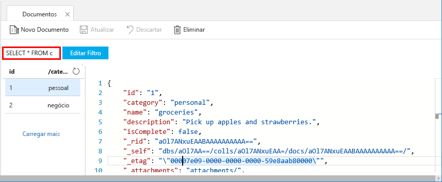
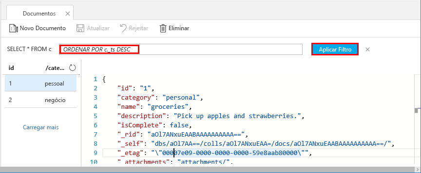

Pode utilizar agora consultas no Data Explorer para obter e filtrar os seus dados.

1. Veja-o por predefinição, a consulta está definida para `SELECT * FROM c`. Esta consulta predefinida obtém e apresenta todos os documentos na coleção. 

    

2. Mantenha-se no separador **Documentos** e altere a consulta ao clicar no botão **Editar Filtro**, adicionar `ORDER BY c._ts DESC` à caixa de predicado de consulta e, em seguida, ao clicar em **Aplicar Filtro**.

    

Esta consulta modificada lista os documentos por ordem decrescente com base no respetivo carimbo de data/hora, por isso agora o segundo documento está listado primeiro. Se estiver familiarizado com a sintaxe do SQL, pode introduzir quaisquer [consultas SQL](../articles/cosmos-db/sql-api-sql-query.md) suportadas nesta caixa. 

Esta ação conclui o nosso trabalho no Data Explorer. Antes de continuarmos para o trabalho com código, note que também pode utilizar o Data Explorer para criar procedimentos armazenados, UDFs e acionadores, para realizar lógica empresarial do lado do servidor, bem como débito de escala. O Data Explorer expõe todos os acessos a dados programáticos incorporados que estão disponíveis nas APIs, mas disponibiliza acesso fácil aos seus dados no portal do Azure.