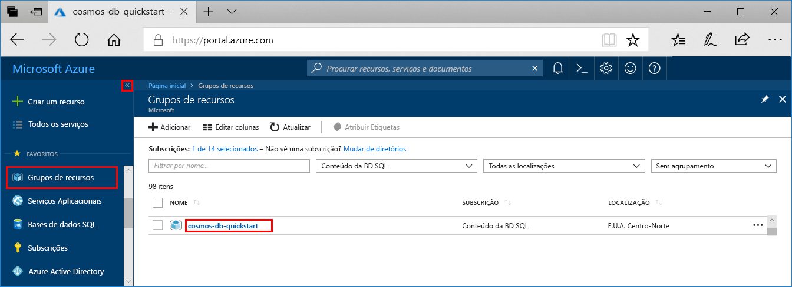
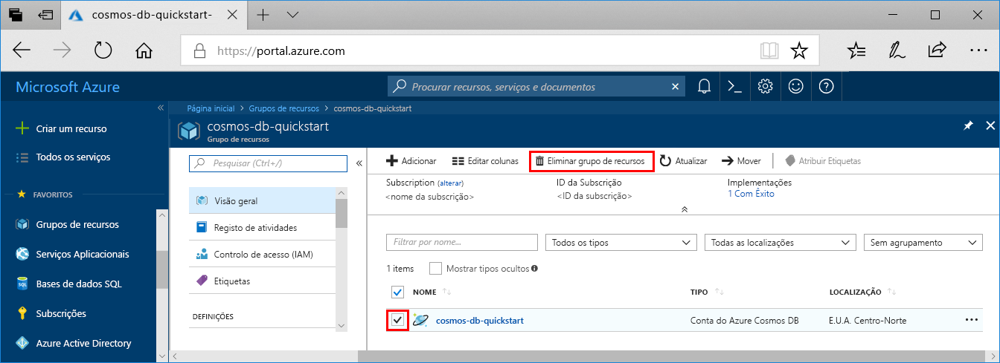

Se não pretender continuar a utilizar esta aplicação, elimine todos os recursos criados com este início rápido com os seguintes passos, para não lhe serem cobrados custos:

1. No portal do Azure, selecione **Grupos de recursos** à esquerda e, em seguida, selecione o grupo de recursos que criou.  

    Se o menu à esquerda estiver fechado, clique no  para expandi-lo.

   

2. Na nova janela, selecione o grupo de recursos e, em seguida, clique em **Eliminar grupo de recursos**.

      

3. Na nova janela, escreva o nome do grupo de recursos a eliminar e, em seguida, clique em **Eliminar**.

