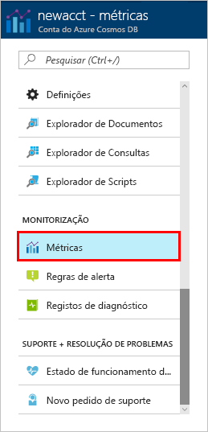
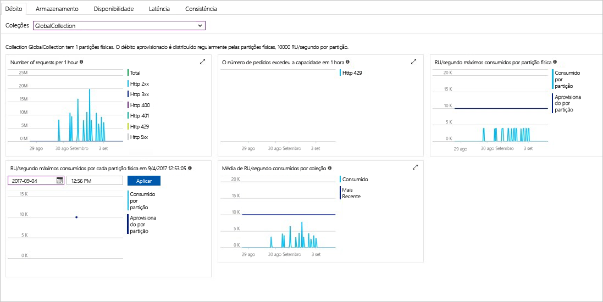

O débito, o armazenamento, a disponibilidade, a latência e a consistência dos recursos na sua conta são monitorizados no portal do Azure. Vamos ver rapidamente estas métricas. 

1. Clique em **Métricas** no menu de navegação.

   

2. Clique em cada um dos separadores para ficar a par das métricas que o Azure Cosmos DB oferece. 

    Cada gráfico que está associado aos [Contratos de Nível de Serviço (SLAs) do Azure Cosmos DB](https://azure.microsoft.com/support/legal/sla/cosmos-db/) apresenta uma linha que mostra se qualquer um dos SLA foi violado. O Azure Cosmos DB faz com que a monitorização dos seus SLAs seja transparente com este conjunto de métricas. 

   