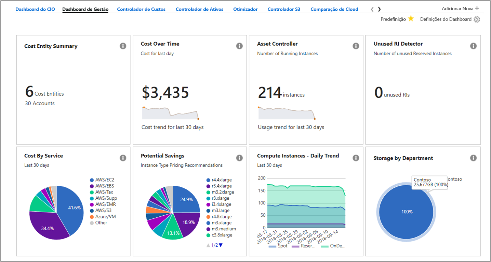
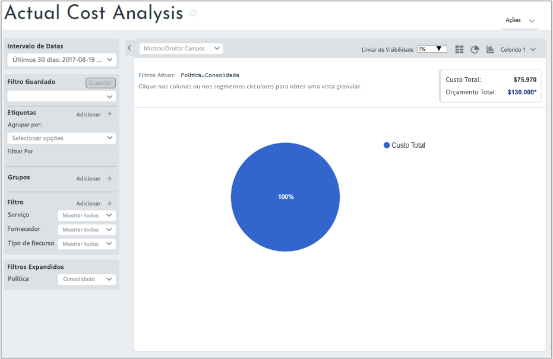
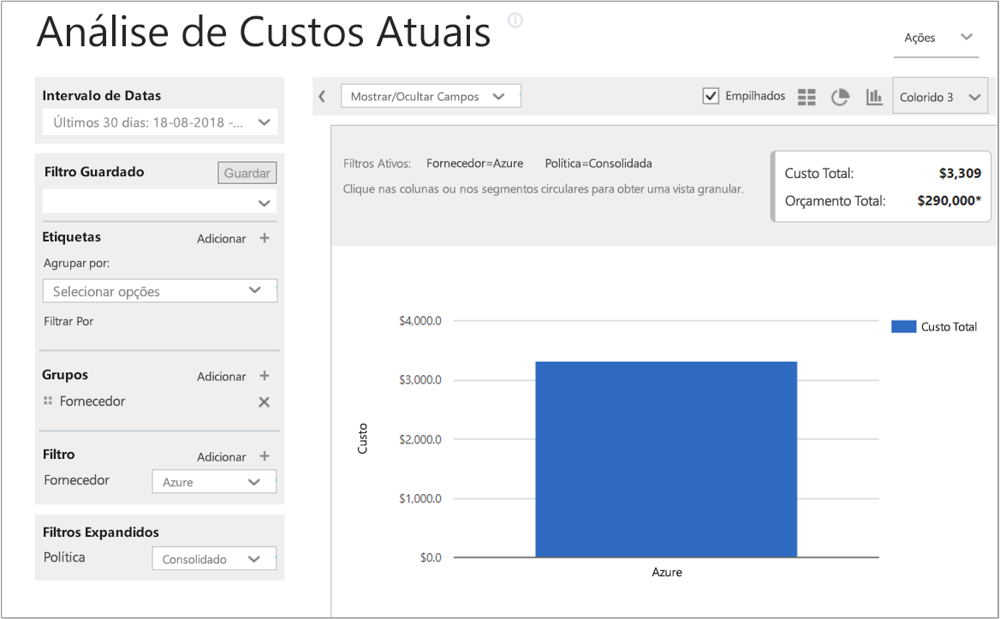
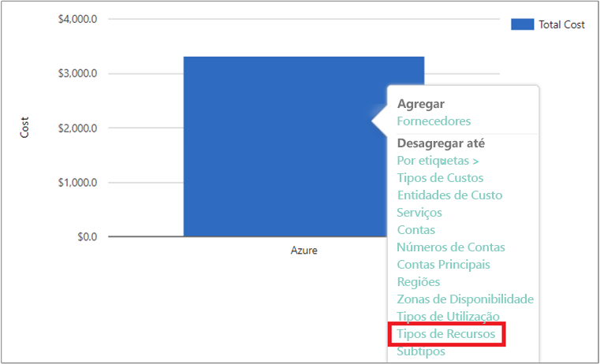
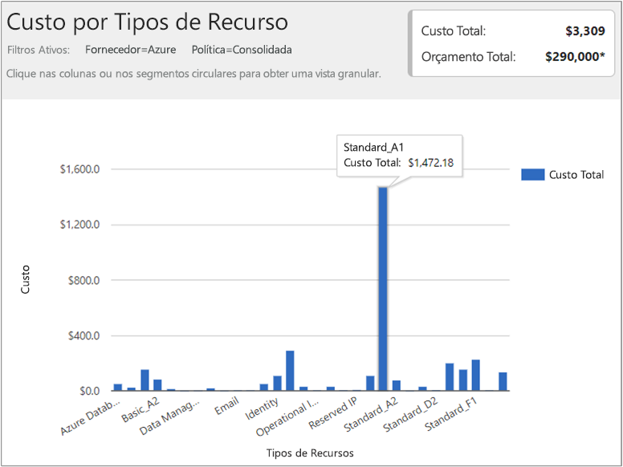
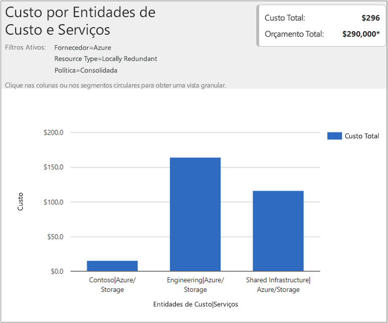

## Ver dados de custos

A Gestão de Custos do Azure pela Cloudyn proporciona acesso a todos os dados dos seus recursos na cloud. A partir dos relatórios do dashboard, pode encontrar relatórios padrão e personalizados numa vista com separadores. Seguem-se alguns exemplos de um dashboard popular e de um relatório que lhe mostram os seus dados de custo de imediato.

Neste exemplo, o dashboard de Gestão mostra os custos consolidados para a empresa Contoso em todos os seus recursos na cloud. A Contoso utiliza o Azure, o AWS e o Google. Os dashboards fornecem informações resumidas e são uma forma rápida de navegar até os relatórios.  

Se não tiver a certeza do objetivo de um relatório num dashboard, coloque o cursor sobre o símbolo **i** para ver uma explicação. Clique em qualquer relatório num dashboard para ver o relatório completo.

Também pode ver relatórios com o menu de relatórios na parte superior do portal. Vamos ver os gastos da Contoso em recursos do Azure nos últimos 30 dias. Clique em **Custos** > **Análise de Custo** > **Análise de Custo Real**. Limpe todos os valores se existirem definições para etiquetas, grupos ou filtros no relatório.

Neste exemplo, $122.273 é o custo total e o orçamento é $290.000.

Agora, vamos modificar o formato do relatório e definir grupos e filtros para restringir os resultados para os custos do Azure. Defina o **Intervalo de Datas** como os últimos 30 dias. No canto superior direito, clique no símbolo de coluna para formatar como um gráfico de barras e, em Grupos, selecione **Fornecedor**. Em seguida, defina um filtro para **Fornecedor** como **Azure**.

Neste exemplo, o custo total de recursos do Azure foi $3.309 nos últimos 30 dias.

Clique com o botão direito do rato na barra Fornecedor (Azure) e desagregue até **Tipos de recursos**.

A imagem seguinte mostra os custos dos recursos do Azure em que a Contoso incorreu. O total foi $3.309. Neste exemplo, cerca de metade dos custos destinou-se a VM Standard_A1 e a outra metade dos custos, aproximadamente, destinou-se a várias instâncias de VM.

Clique com o botão direito do rato num tipo de recurso e selecione **Entidades de Custos** para ver as entidades dos custos e os serviços que consumiram o recurso. Na imagem de exemplo seguinte o Armazenamento Localmente Redundante é definido como o Tipo de recurso. Contoso | Azure/armazenamento consumido $15,65. Engenharia | Armazenamento do Azure consumido $164,25. Infraestrutura Partilhada | Azure/Armazenamento consumido $116,58. O custo total dos serviços é de $296.

Para ver um vídeo tutorial sobre a visualização dos dados de faturação da cloud, veja [Analyzing your cloud billing data with Azure Cost Management by Cloudyn (Analisar os dados de faturação da cloud com o Azure Cost Management da Cloudyn)](https://youtu.be/G0pvI3iLH-Y).
