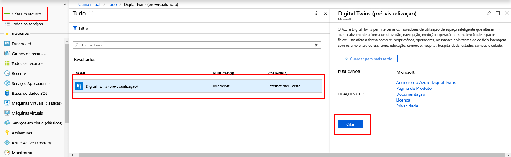
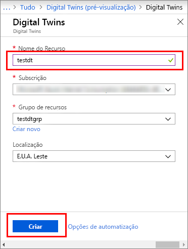
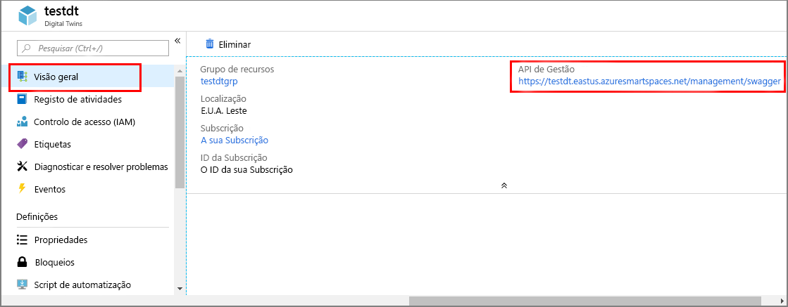

1. Inicie sessão no [portal do Azure](http://portal.azure.com).

1. No painel de navegação do lado esquerdo, clique em **Criar um recurso**. Procure *Digital Twins* e selecione **Digital Twins (pré-visualização)**. Clique em **Criar** para iniciar o processo de implementação.

    

1. No painel **Digital Twins**, introduza as seguintes informações:
   * **Nome do Recurso**: crie um nome exclusivo para a instância do Digital Twins.
   * **Subscrição**: escolha a subscrição que quer utilizar para criar esta instância do Digital Twins. 
   * **Grupo de recursos**: selecione ou crie um [grupo de recursos](https://docs.microsoft.com/azure/azure-resource-manager/resource-group-overview#resource-groups) para a instância do Digital Twins.
   * **Localização**: selecione a localização mais próxima dos seus dispositivos.

    

1. Reveja as informações do Digital Twins e, em seguida, clique em **Criar**. A instância do Digital Twins poderá demorar alguns minutos a ser criada. Pode monitorizar o progresso no painel **Notificações**.

1. Abra o painel **Descrição geral** da instância do Digital Twins. Repare na ligação apresentada em **API de gestão**.

    1. O URL da **API de gestão** é formatado como: **_https://yourDigitalTwinsName.yourLocation.azuresmartspaces.net/management/swagger_**. Este URL leva-o para a documentação da API REST do Azure Digital Twins que se aplica à sua instância. Leia [Como utilizar o Azure Digital Twins Swagger](../articles/digital-twins/how-to-use-swagger.md) para saber como ler e utilizar esta documentação de API.

    1. Modifique o URL da **API de gestão** para este formato: **_https://yourDigitalTwinsName.yourLocation.azuresmartspaces.net/management/api/v1.0/_**. A aplicação irá utilizar o URL modificado como URL base para aceder à sua instância. Copie este URL modificado para um ficheiro temporário. Irá precisar dele na secção seguinte.

    