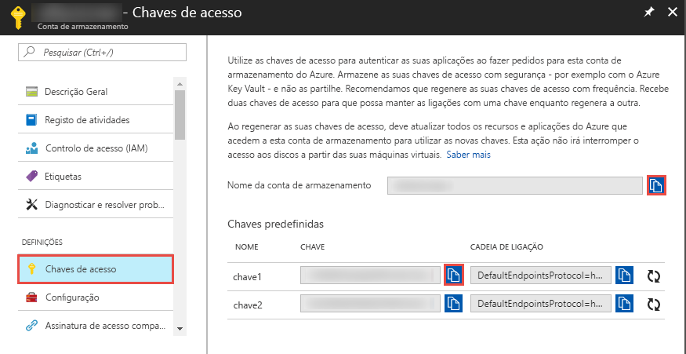

## <a name="prerequisites"></a>Pré-requisitos

### <a name="azure-subscription"></a>Subscrição do Azure
Se não tiver uma subscrição do Azure, crie uma [conta gratuita](https://azure.microsoft.com/free/) antes de começar.

### <a name="azure-roles"></a>Funções do Azure
Para criar instâncias do Data Factory, a conta de utilizador que utiliza para iniciar sessão no Azure tem de ser membro das funções *contribuidor* ou *proprietário* ou *administrador* da subscrição do Azure. No portal do Azure, selecione o seu nome de utilizador no canto superior direito e selecione **Permissões** para ver as permissões que tem na subscrição. Se tiver acesso a várias subscrições, selecione a subscrição apropriada. Para obter instruções de exemplo sobre como adicionar um utilizador a uma função, veja o artigo [Add roles](../articles/billing/billing-add-change-azure-subscription-administrator.md) (Adicionar funções).

### <a name="azure-storage-account"></a>Conta de armazenamento do Azure
Neste início rápido, vai utilizar uma conta de armazenamento do Azure para fins gerais (especificamente o armazenamento de Blobs) como arquivo de dados de *origem* e de *destino*. Se não tiver uma conta de armazenamento do Azure para fins gerais, veja [Criar uma conta de armazenamento](../articles/storage/common/storage-create-storage-account.md#create-a-storage-account) para criar uma. 

#### <a name="get-the-storage-account-name-and-account-key"></a>Obter o nome e a chave da conta de armazenamento
Utilize o nome e a chave da sua conta de armazenamento do Azure neste início rápido. O procedimento seguinte disponibiliza os passos para obter o nome e a chave da conta de armazenamento: 

1. Num browser, aceda ao [Portal do Azure](https://portal.azure.com). Inicie sessão com o nome de utilizador e palavra-passe do Azure. 
2. Selecione **Mais serviços** no menu à esquerda, filtre com a palavra-chave **Armazenamento** e selecione **Contas de armazenamento**.

   
3. Na lista das contas de armazenamento, filtre para encontrar a sua conta de armazenamento (se necessário) e selecione-a. 
4. Na página **Conta de armazenamento**, selecione **Chaves de acesso**, no menu.

   
5. Copie os valores das caixas **Nome da conta de armazenamento** e **key1** para a área de transferência. Cole-os no Bloco de Notas ou noutro editor e guarde-os. Vai utilizá-los mais tarde neste início rápido.   

#### <a name="create-the-input-folder-and-files"></a>Criar pasta e ficheiros de entrada
Nesta secção, vai criar um contentor de blobs com o nome **adftutorial** no armazenamento de Blobs do Azure. Crie uma pasta chamada **input** no contentor e, em seguida, carregue um ficheiro de exemplo para essa pasta. 

1. Na página **Conta de armazenamento**, mude para a **Descrição Geral** e selecione **Blobs**. 

   
2. Na página **Serviço Blob**, selecione **+Contentor** na barra de ferramentas. 

       
3. Na caixa de diálogo **Novo contentor**, introduza **adftutorial** para o nome e selecione **OK**. 

   
4. Selecione **adftutorial** na lista de contentores. 

   
1. Na página **Contentor**, selecione **Carregar** na barra de ferramentas.  

   
6. Na página **Carregar blob**, selecione **Avançadas**.

   
7. Inicie o **Bloco de Notas** e crie um ficheiro com o nome **emp.txt** com os conteúdos seguintes. Guarde-o na pasta **c:\ADFv2QuickStartPSH**. Crie a pasta **ADFv2QuickStartPSH**, se esta ainda não existir.
    
   ```
   John, Doe
   Jane, Doe
   ```    
8. No portal do Azure, na página **Carregar blob**, procure e selecione o ficheiro **emp.txt** para a caixa **Ficheiros**. 
9. Introduza **input** como um valor na caixa **Carregar para a pasta**. 

        
10. Confirme se a pasta é **input** e se o ficheiro é **emp.txt**, e selecione **Carregar**.
    
    Deverá ver o ficheiro **emp.txt** e o estado do carregamento na lista. 
12. Feche a página **Carregar blob** clicando no **X** no canto. 

    
1. Mantenha a página do **Contentor** aberta. Vai utilizá-la para verificar a saída no final deste início rápido.