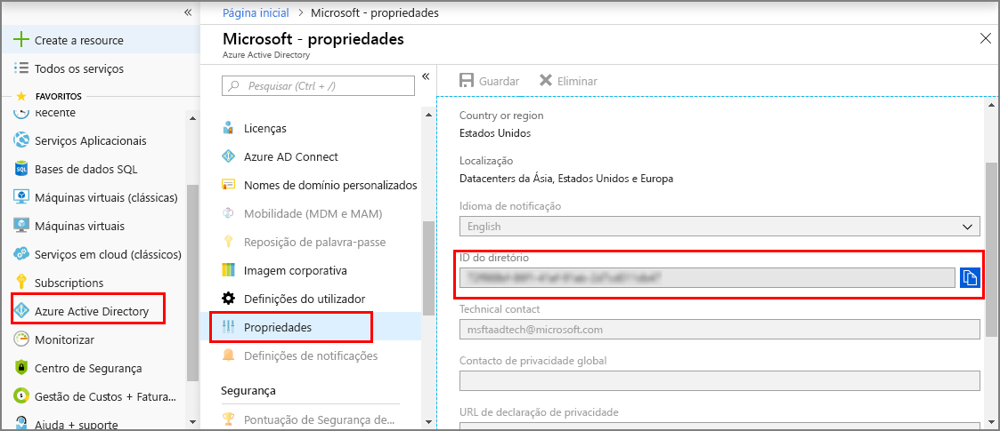
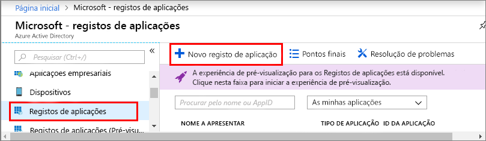
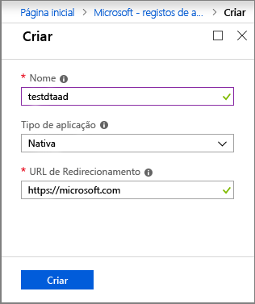
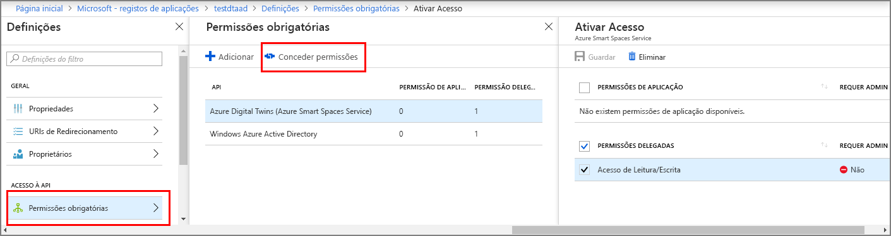

1. No [portal do Azure](https://portal.azure.com), abra o **Azure Active Directory** a partir do painel de navegação esquerdo e, em seguida, abra o painel **Propriedades**. Copie o **ID do diretório** para um ficheiro temporário. Irá utilizar este valor para configurar a aplicação de exemplo na secção seguinte.

    

1. Abra o painel **Registos de aplicações** e, em seguida, clique no botão **Novo registo de aplicação**.
    
    

1. Atribua um nome amigável a este registo de aplicação no campo **Nome**. Selecione **Tipo de aplicação** como **_Nativo_** e **URI de redirecionamento** como **_https://microsoft.com_**. Clique em **Criar**.

    

1. Abra a aplicação registada e copie o valor do campo **ID da aplicação** para um ficheiro temporário; este valor identifica a sua aplicação do Azure Active Directory. Irá utilizar o ID da Aplicação para configurar a aplicação de exemplo nas secções seguintes.

    

1. Abra o painel de registo de aplicação e clique em **Definições** > **Permissões obrigatórias**:
    - Clique em **Adicionar** na parte superior esquerda para abrir o painel **Adicionar acesso à API**.
    - Clique em **Selecionar uma API** e procure **Azure Digital Twins**. Se a pesquisa não localizar a API, procure **Azure Smart Spaces** como alternativa.
    - Selecione a opção **Azure Digital Twins (Azure Smart Spaces Service)** e clique em **Selecionar**.
    - Clique em **Selecionar permissões**. Selecione a caixa de permissões delegadas **Acesso de Leitura/Escrita** e clique em **Selecionar**.
    - Clique em **Concluído** no painel **Adicionar acesso à API**.
    - No painel **Permissões obrigatórias**, clique no botão **Conceder permissões** e aceite a confirmação apresentada.

       
