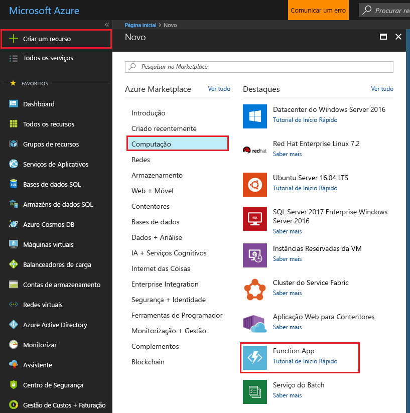
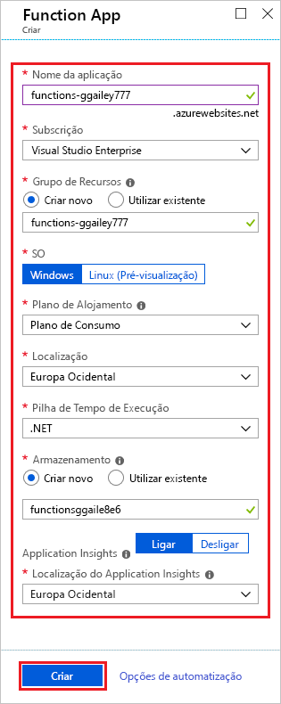
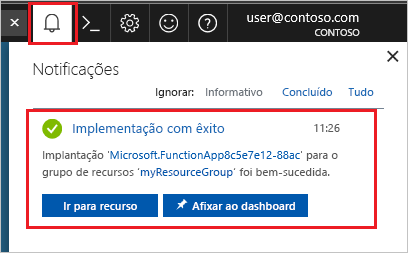

1. Selecione o botão **Novo** no canto superior esquerdo do portal do Azure e, em seguida, selecione **Computação** > **Function App**. 

    

2. Utilize as definições da aplicação Function App, conforme especificado na tabela abaixo da imagem.

    

    | Definição      | Valor sugerido  | Descrição                                        |
    | ------------ |  ------- | -------------------------------------------------- |
    | **Nome da aplicação**  | Nome globalmente exclusivo | Nome que identifica a sua aplicação Function App nova. Os carateres válidos são `a-z`, `0-9` e `-`.  | 
    | **Subscrição** | A sua subscrição | A subscrição sob a qual esta nova aplicação de função é criada. | 
    | **[Grupo de Recursos](../articles/azure-resource-manager/resource-group-overview.md)** |  myResourceGroup | Nome do grupo de recursos novo no qual a aplicação Function App vai ser criada. | 
    | **OS** | Windows | O alojamento sem servidor está atualmente apenas disponível ao executar no Windows. Para alojamento do Linux, consulte [Criar a sua primeira função em execução no Linux com a CLI do Azure](../articles/azure-functions/functions-create-first-azure-function-azure-cli-linux.md). |
    | **[Plano de alojamento](../articles/azure-functions/functions-scale.md)** | Plano de consumo | O plano de alojamento que define a forma como os recursos são alocados à sua aplicação Function App. No **Plano de Consumo** predefinido, os recursos são adicionados dinamicamente, conforme necessário por parte das suas funções. Neste alojamento [sem servidor](https://azure.microsoft.com/overview/serverless-computing/), só paga pelo tempo de execução das suas funções. Quando executa num plano do Serviço de Aplicações, tem de gerir o [dimensionamento da sua aplicação de funções](../articles/azure-functions/functions-scale.md).  |
    | **Localização** | Europa Ocidental | Escolha uma [região](https://azure.microsoft.com/regions/) perto de si ou de outros serviços aos quais as suas funções acedem. |
    | **[Conta de armazenamento](../articles/storage/common/storage-quickstart-create-account.md)** |  Nome globalmente exclusivo |  O nome da conta de armazenamento nova utilizada pela sua aplicação Function App. Os nomes das contas do Storage devem ter entre 3 e 24 carateres de comprimento e apenas podem conter números e letras minúsculas. Também pode utilizar uma conta existente, a qual tem de cumprir os [requisitos de contas de armazenamento](../articles/azure-functions/functions-scale.md#storage-account-requirements). |

3. Selecione **Criar** para aprovisionar e implementar a aplicação de função.

4. Selecione o ícone de Notificação no canto superior direito do portal e procure a mensagem **Implementação concluída com êxito**. 

    

5. Selecione **Ir para o recurso** para ver a sua nova aplicação de funções.

> [!TIP]
> Está com dificuldade em encontrar as suas aplicações de funções no portal? Experimente [adicionar as Aplicações de Funções aos favoritos no portal do Azure](../articles/azure-functions/functions-how-to-use-azure-function-app-settings.md#favorite).   
