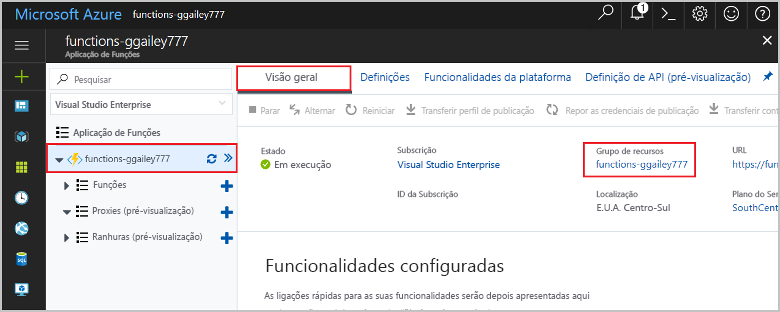

Outros guias de introdução nesta coleção são criados através deste guia de introdução. Se pretender trabalhar com guias de introdução subsequentes, tutoriais ou com qualquer um dos serviços que criou neste guia de introdução, não limpe os recursos.

Os *recursos* no Azure referem-se a aplicações de funções, funções, contas de armazenamento e assim sucessivamente. Estes são agrupados em *grupos de recursos* e pode eliminar tudo num grupo ao eliminá-lo. 

Criou recursos para concluir estes guias de introdução. Poderá ser-lhe cobrado estes recursos, dependendo do seu [estado da conta](https://azure.microsoft.com/account/) e dos [preços dos serviços](https://azure.microsoft.com/pricing/). Se já não precisar dos recursos, pode eliminá-los da seguinte forma:

1. No portal do Azure, visite a página **Grupo de recursos**. 

   Para aceder a essa página a partir da página da aplicação de função, selecione o separador **Descrição geral** e, em seguida, selecione a ligação em **Grupo de recursos**.

   

   Para aceder a essa página a partir do dashboard, selecione **Grupos de recursos** e, em seguida, selecione o grupo de recursos que utilizou para este guia de introdução.

2. Na página **Grupo de recursos**, reveja a lista dos recursos incluídos e certifique-se de que são aqueles que pretende eliminar.
 
3. Selecione **Eliminar grupo de recursos** e siga as instruções.

   A eliminação pode demorar alguns minutos. Quando terminar, é apresentada uma notificação durante alguns segundos. Também pode selecionar o ícone de sino na parte superior da página para ver a notificação.
