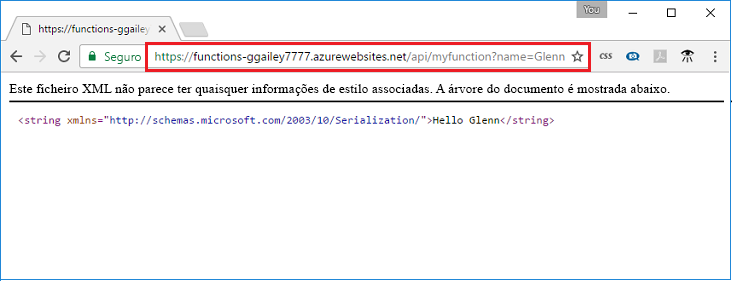

## <a name="test"></a>Testar a função

Utilize o cURL para testar a função implementada num computador Mac ou Linux ou com o Powershell no Windows. Execute o comando cURL seguinte, substituindo o marcador de posição `<app_name>` pelo nome da sua aplicação Function App. Anexe a cadeia de consulta `&name=<yourname>` ao URL.

```powershell
Invoke-WebRequest -Uri "https://<app_name>.azurewebsites.net/api/MyHttpTrigger?name=<yourname>"
```

```bash
curl https://<app_name>.azurewebsites.net/api/MyHttpTrigger?name=<yourname>
```  

  

Se não tiver `cURL`ou `Invoke-WebRequest` disponíveis na sua linha de comandos, introduza o endereço do seu navegador da web, o mesmo URL. Mais uma vez, substitua o marcador de posição `<app_name>` pelo nome da aplicação de funções, anexe a cadeia de consulta `&name=<yourname>` ao URL e execute o pedido.

    https://<app_name>.azurewebsites.net/api/MyHttpTrigger?name=<yourname>
   
  
