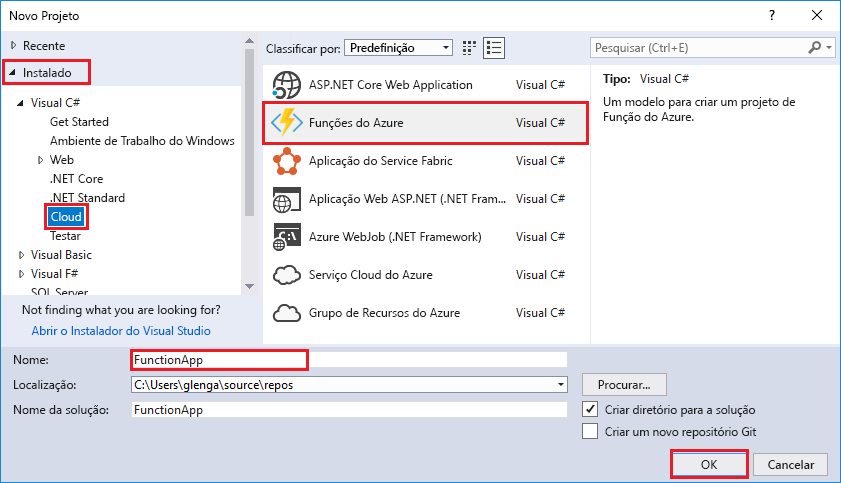
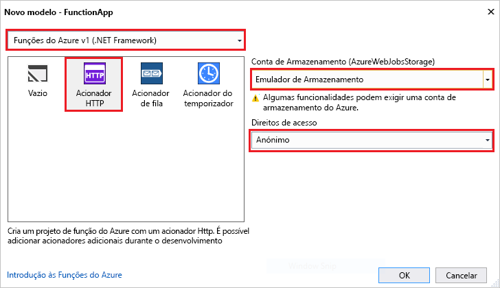

O modelo do projeto das Funções do Azure no Visual Studio cria um projeto que pode ser publicado numa aplicação de funções no Azure. Permite de aplicação de função, grupo de funções como uma unidade lógica para gestão, a implementação e a partilha de recursos.   

1. No Visual Studio, selecione **novo** > **projeto** do **ficheiro** menu. 

2. No **novo projeto** caixa de diálogo, selecione **instalada**, expanda **Visual c#** > **nuvem**, selecione **Azure As funções**, escreva um **nome** para o seu projeto e clique em **OK**. O nome da aplicação de funções deve ser válido como um espaço de nomes C#. Portanto, não use sublinhados, hífenes ou outros carateres não alfanuméricos. 

     

2. Utilize as definições especificadas na tabela que se segue a imagem.
 
     

    | Definição      | Valor sugerido  | Descrição                      |
    | ------------ |  ------- |----------------------------------------- |
    | **Versão** | As funções do Azure v1  (.NET Framework) | Esta ação cria um projeto de função que utiliza o tempo de execução da versão 1 das funções do Azure. O tempo de execução da versão 2, que suporta o .NET Core, está atualmente em pré-visualização. Para obter mais informações, consulte [como versão de tempo de execução das funções do Azure de destino](../articles/azure-functions/functions-versions.md).   | 
    | **Modelo** | Acionador HTTP | Esta ação cria uma função acionada por um pedido de HTTP. |
    | **Conta de armazenamento**  | Emulador de armazenamento | Um acionador HTTP não utiliza a ligação de conta de armazenamento. Todos os outros tipos de Acionador necessitam de uma cadeia de ligação de conta de armazenamento válida. |
    | **Direitos de acesso** | Anónima | A função criada pode ser acionada por qualquer cliente sem fornecer uma chave. Esta definição de autorização torna mais fácil testar a nova função. Para obter mais informações sobre chaves e autorização, consulte [chaves de autorização](../articles/azure-functions/functions-bindings-http-webhook.md#authorization-keys) no [enlaces HTTP e webhook](../articles/azure-functions/functions-bindings-http-webhook.md). |         
3. Clique em **OK** para criar a função de projeto e HTTP acionada função. 

