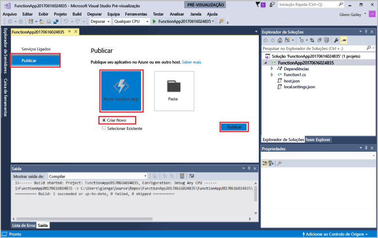
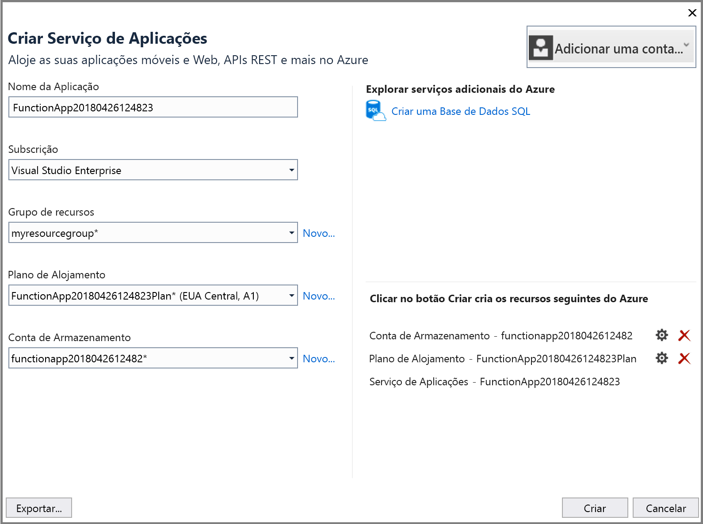
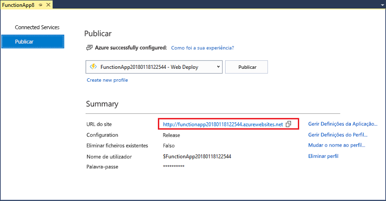

1. No **Explorador de Soluções**, clique com o botão direito do rato no projeto e selecione **Publicar**. Escolha **criar novos** e, em seguida, **publicar**. 

    

2. Se já não tiver ligado Visual Studio à sua conta do Azure, selecione **adicionar uma conta...** .  

3. Na caixa de diálogo **Criar Serviço de Aplicações**, utilize as definições do **Sistema Anfitrião** conforme especificado na tabela seguinte: 

    

    | Definição      | Valor sugerido  | Descrição                                |
    | ------------ |  ------- | -------------------------------------------------- |
    | **Nome da Aplicação** | Nome globalmente exclusivo | Nome que identifica exclusivamente a sua nova aplicação de funções. |
    | **Subscrição** | Escolher a sua subscrição | A subscrição do Azure que deve utilizar. |
    | **[Grupo de Recursos](../articles/azure-resource-manager/resource-group-overview.md)** | myResourceGroup |  Nome do grupo de recursos no qual a sua aplicação de funções será criada. Escolha **novo** para criar um novo grupo de recursos.|
    | **[Plano do Serviço de Aplicações](../articles/azure-functions/functions-scale.md)** | Plano de consumo | Certifique-se de que escolhe o **consumo** em **tamanho** depois de clicar em **novo** para criar um novo plano. Além disso, escolha um **localização** num [região](https://azure.microsoft.com/regions/) perto de si ou junto de outros serviços as suas funções aceder.  |

    >[!NOTE]
    >É necessária uma conta de armazenamento do Azure pelo tempo de execução de funções. Por este motivo, é criada uma nova conta de armazenamento do Azure por si quando criar uma aplicação de função.

4. Clique em **criar** para criar uma aplicação de função e os recursos relacionados no Azure com estas definições e implementar o código de projeto de função. 

5. Depois de concluída a implementação, anote o **URL do Site** valor, o que é o endereço da sua aplicação de função no Azure.

    
