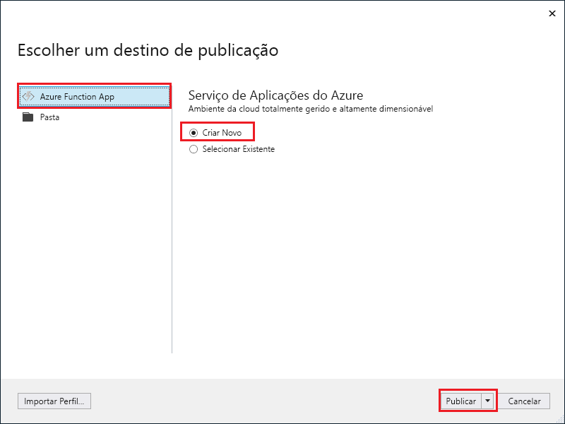

1. No **Explorador de Soluções**, clique com o botão direito do rato no projeto e selecione **Publicar**.

2. Selecione **Aplicação de Função do Azure**, escolha **Criar Nova**  e selecione **Publicar**.

    

2. Se ainda não tiver associado o Visual Studio à sua conta do Azure, selecione **Adicionar uma conta...**.

3. Na caixa de diálogo **Criar Serviço de Aplicações**, utilize as definições de **Anfitrião**, conforme especificadas na tabela abaixo da imagem:

    

    | Definição      | Valor sugerido  | Descrição                                |
    | ------------ |  ------- | -------------------------------------------------- |
    | **Nome da Aplicação** | Nome globalmente exclusivo | Nome que identifica exclusivamente a sua nova aplicação de funções. |
    | **Subscrição** | Escolher a sua subscrição | A subscrição do Azure que deve utilizar. |
    | **[Grupo de Recursos](../articles/azure-resource-manager/resource-group-overview.md)** | myResourceGroup |  Nome do grupo de recursos no qual a sua aplicação de funções será criada. Escolha **Novo** para criar um grupo de recursos novo.|
    | **[Plano do Serviço de Aplicações](../articles/azure-functions/functions-scale.md)** | Plano de consumo | Confirme que escolhe o **Consumo**, em **Tamanho**, depois de clicar em **Novo** para criar um plano. Escolha também uma **Localização** numa [região](https://azure.microsoft.com/regions/) perto de si ou de outros serviços aos quais as suas funções acedem.  |
    | **[Conta de Armazenamento](../articles/storage/common/storage-create-storage-account.md#create-a-storage-account)** | Conta de armazenamento para fins gerais | O runtime das Funções precisa de uma conta de armazenamento do Azure. Clique em **Nova** para criar uma conta de armazenamento para fins gerais ou utilize uma já existente.  |

4. Clique em **Criar** para criar uma aplicação de função e os recursos relacionados no Azure com estas definições e implemente o código do projeto de função. 

5. Quando a implementação estiver concluída, aponte o valor **URL do Site**, que é o endereço da sua aplicação de função no Azure.

    
