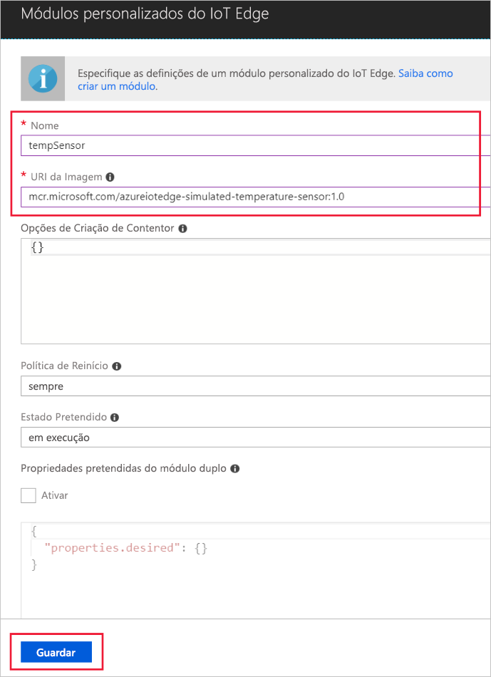

Uma das principais funcionalidades do Azure IoT Edge é conseguir implementar módulos nos seus dispositivos do IoT Edge a partir da cloud. Os módulos do IoT Edge são pacotes executáveis que são implementados como contentores. Nesta secção, vai implementar um módulo que gera telemetria para o seu dispositivo simulado. 

1. No portal do Azure, navegue para o seu hub IoT.
1. Aceda a **IoT Edge (pré-visualização)** e selecione o seu dispositivo IoT Edge.
1. Selecione **Definir Módulos**.
1. Selecione **Adicionar módulo do IoT Edge**.
1. No campo **Nome**, introduza `tempSensor`. 
1. No campo **URI da Imagem**, introduza `microsoft/azureiotedge-simulated-temperature-sensor:1.0-preview`. 
1. Deixe as outras definições inalteradas e selecione **Guardar**.

   

1. Novamente no passo **Adicionar módulos**, selecione **Seguinte**.
1. No passo **Especificar rotas**, selecione **Seguinte**.
1. No passo **Rever modelo**, selecione **Submeter**.
1. Regresse à página de detalhes do dispositivo e selecione **Atualizar**. Deverá ver o módulo tempSensor novo em execução, juntamente com o runtime do IoT Edge. 

   ![Vista de tempSensor na lista de módulos implementados][1]

<!-- Images -->
[1]: ../articles/iot-edge/media/tutorial-simulate-device-windows/view-module.png