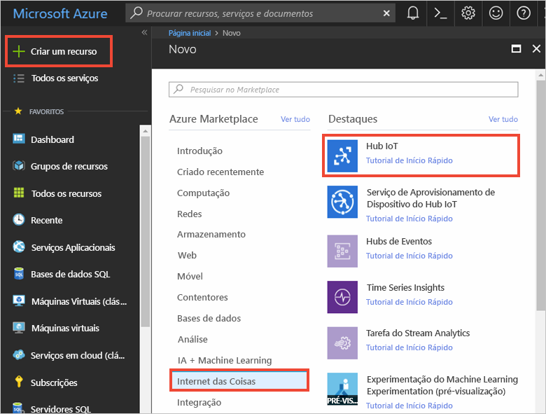
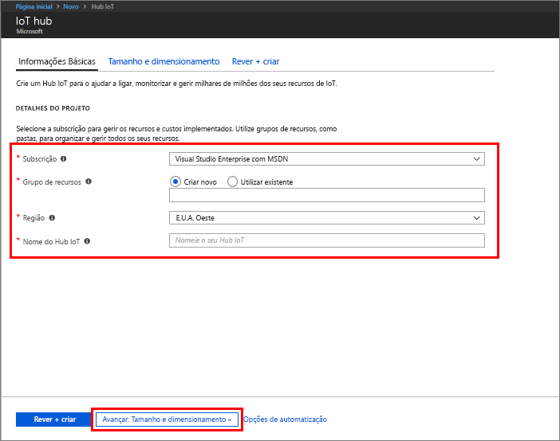
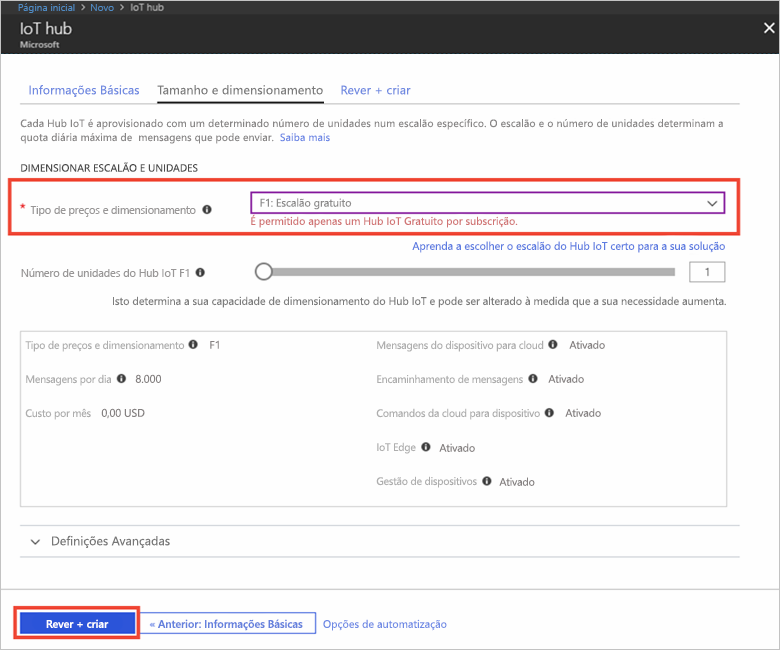

1. Inicie sessão no [portal do Azure](https://portal.azure.com/).

2. Selecione **Criar um recurso** > **Internet das Coisas** > **Hub IoT**.
   
    

3. No painel **Hub IoT**, introduza as seguintes informações para o hub IoT:

   * **Subscrição**: escolha a subscrição que quer utilizar para criar este hub IoT.

   * **Grupo de recursos**: crie um grupo de recursos para utilizar o hub IoT ou utilize um já existente. Para obter mais informações, veja [Utilizar grupos de recursos para gerir os recursos do Azure](../articles/azure-resource-manager/resource-group-portal.md).

   * **Região**: selecione a localização mais próxima de si.

   * **Nome**: crie um nome para o seu hub IoT. Se o nome introduzido estiver disponível, aparece uma marca de verificação verde.

   [!INCLUDE [iot-hub-pii-note-naming-hub](iot-hub-pii-note-naming-hub.md)]

   

4. Selecione **Seguinte: tamanho e dimensionamento** para continuar a criar o seu hub IoT. 

5. Selecione o seu **Escalão de preço e dimensionamento**. Neste artigo, selecione o escalão **F1 - Gratuito** se ainda estiver disponível na sua subscrição. Para obter mais informações, veja o [escalão de preços e dimensionamento](https://azure.microsoft.com/pricing/details/iot-hub/).

   

6. Selecione **Rever + criar**.

7. Reveja as informações do hub IoT e, em seguida, clique em **Criar**. A criação do hub IoT pode demorar alguns minutos. Pode monitorizar o progresso no painel **Notificações**.