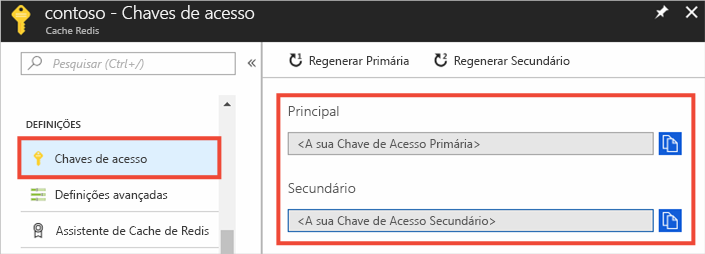
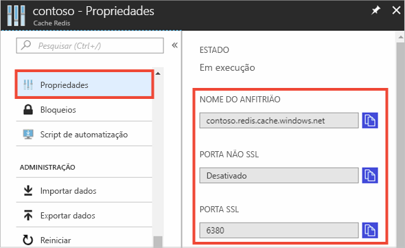

### Obter o nome do anfitrião, as portas e as chaves de acesso através do portal do Azure

Ao ligar a uma Cache do Azure do Azure para a instância de Redis, clientes de cache tem o nome de anfitrião, portas e uma chave para a cache. Alguns clientes podem mencionar esses itens com nomes ligeiramente diferentes. Pode obter estas informações no portal do Azure.

#### Para obter as chaves de acesso e o nome do anfitrião

1. Para obter as chaves de acesso através do [portal do Azure](https://portal.azure.com), navegue até à sua cache e selecione **Chaves de acesso**. 

    

2. Para obter o nome do anfitrião e as portas, selecione **Propriedades**.

    

