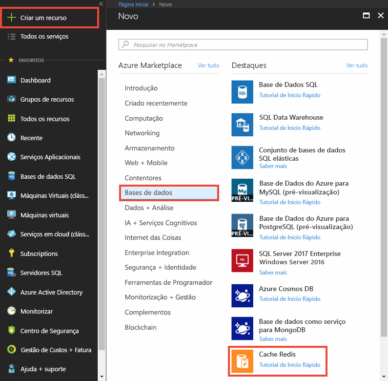
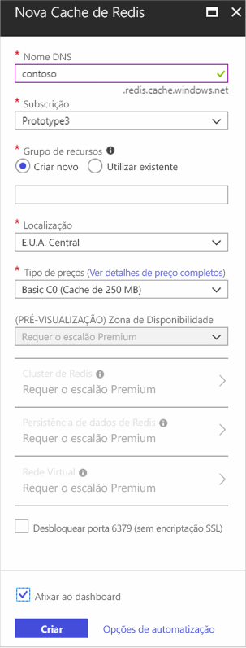
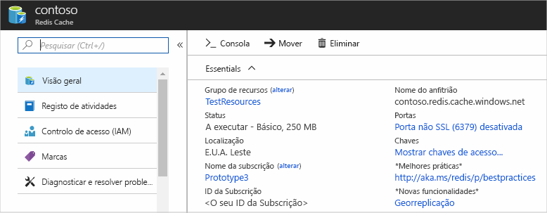

Para criar uma cache, primeiro inicie sessão no [portal do Azure](https://portal.azure.com) e clique em **Criar um recurso** > **Bases de Dados** > **Cache de Redis**.

Em **Nova Cache de Redis**, configure as definições para a nova cache.

| Definição      | Valor sugerido  | Descrição |
| ------------ |  ------- | -------------------------------------------------- |
| **Nome DNS** | Nome globalmente exclusivo | O nome da cache tem de ser uma cadeia entre 1 e 63 carateres e conter apenas números, letras e o caráter `-`. O nome da cache não pode começar nem terminar com o caráter `-` e os carateres `-` consecutivos não são válidos.  | 
| **Subscrição** | A sua subscrição | A subscrição no âmbito da qual esta nova Cache de Redis do Azure é criada. | 
| **Grupo de Recursos** |  *TestResourceGroup* | Nome do grupo de recursos novo no qual a cache será criada. Ao colocar todos os recursos de uma aplicação num grupo, pode geri-los em conjunto. Por exemplo, eliminar o grupo de recursos eliminará todos os recursos associados à aplicação. | 
| **Localização** | EUA Leste | Selecione uma [região](https://azure.microsoft.com/regions/) próxima de outros serviços que irão utilizar a cache. |
| **[Escalão de preço](https://azure.microsoft.com/pricing/details/cache/)** |  C0 básico (Cache de 250 MB) |  O escalão de preço determina o tamanho, o desempenho e as funcionalidades disponíveis para a cache. Para obter mais informações, veja [Azure Redis Cache Overview](../articles/redis-cache/cache-overview.md) (Descrição Geral da Cache de Redis do Azure). |
| **Afixar ao dashboard** |  Selecionado | Clique para afixar a nova cache ao dashboard e torná-la fácil de localizar. |

 

Uma vez configuradas as definições da nova cache, clique em **Criar**. 

A criação da cache pode demorar alguns minutos. Para verificar o estado, pode monitorizar o progresso no dashboard. Uma vez criada, a nova cache tem o estado **Em Execução** e está pronta para ser utilizada.

