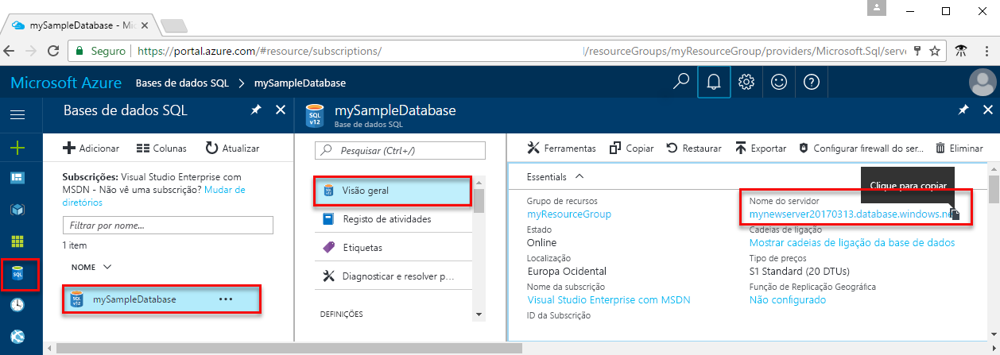

<!-- sql-database-connect-query-prerequisites-server-connection-info-includes.md 

## SQL server connection information
-->

Obtenha as informações de ligação necessárias para ligar à base de dados SQL do Azure. Irá precisar do nome de servidor totalmente qualificado, do nome de base de dados e das informações de início de sessão nos seguintes procedimentos.

1. Inicie sessão no [portal do Azure](https://portal.azure.com/).

1. Selecione **Bases de dados SQL** no menu do lado esquerdo e clique na sua base de dados na página **Bases de dados SQL**.

1. Na página **Overview (Descrição geral)** da sua base de dados, reveja o nome de servidor totalmente qualificado, como mostrado na imagem seguinte. Pode pairar o rato sobre o **nome do servidor** para abrir o **clique para copiar** opção.  

   

1. Se se esqueceu das informações de início de sessão do seu servidor, pode clicar no **nome do servidor** para navegar para o **do SQL server** página e ver o **administrador do servidor** nome. Se necessário, selecione **Repor palavra-passe**.
