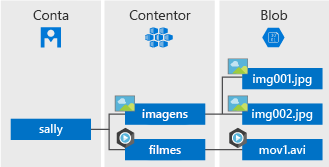

O Armazenamento de Blobs do Azure é a solução de armazenamento de objetos da Microsoft para a cloud. O Armazenamento de blobs está otimizado para armazenar grandes quantidades de dados não estruturados, como dados de texto ou binários.

O armazenamento de blobs é ideal para:

* Entrega de imagens ou documentos diretamente a um browser.
* Armazenamento de ficheiros para acesso distribuído.
* Transmissão de áudio e vídeo.
* Escrever nos ficheiros de registo.
* Armazenamento de dados de cópia de segurança e restauro, recuperação após desastre e arquivo.
* Armazenamento de dados para análise por um serviço no local ou alojado no Azure.

Os Objetos no Armazenamento de blobs podem ser acedidos em qualquer local no mundo através de HTTP ou HTTPS. Os utilizadores ou aplicações de cliente podem aceder a blobs através de URLs, à [API REST do Armazenamento do Azure](https://docs.microsoft.com/rest/api/storageservices/blob-service-rest-api), ao [Azure PowerShell](https://docs.microsoft.com/powershell/module/azure.storage), à [CLI do Azure](https://docs.microsoft.com/cli/azure/storage) ou a uma biblioteca de cliente do Armazenamento do Azure. As bibliotecas de clientes de armazenamento estão disponíveis para muitas linguagens, incluindo [.NET](https://docs.microsoft.com/dotnet/api/overview/azure/storage/client), [Java](https://docs.microsoft.com/java/api/overview/azure/storage/client), [Node.js](http://azure.github.io/azure-storage-node), [Python](https://docs.microsoft.com/python/azure/), [PHP](http://azure.github.io/azure-storage-php/) e [Ruby](http://azure.github.io/azure-storage-ruby).

## Conceitos do serviço Blob

O armazenamento do blob expõe três recursos: a sua conta de armazenamento, os contentores na conta e os blobs num contentor. O diagrama seguinte mostra a relação entre estes recursos.

### Conta de Armazenamento

Todo o acesso a objetos de dados no Armazenamento do Azure ocorre através de uma conta de armazenamento. Para obter mais informações, veja [Acerca das contas de armazenamento do Azure](../articles/storage/common/storage-create-storage-account.md?toc=%2fazure%2fstorage%2fblobs%2ftoc.json).

### Contentor

Um contentor organiza um conjunto de blobs, de forma semelhante a uma pasta num sistema de ficheiros. Todos os blobs residem num contentor. Uma conta de armazenamento pode conter um número ilimitado de contentores, e um contentor pode armazenar um número ilimitado de blobs. Tenha em atenção que o nome do contentor tem de ser em minúsculas.

### Blobs
 
O Armazenamento do Azure oferece três tipos de blobs - blobs de blocos, blobs de acréscimo e [blobs de páginas](../articles/storage/blobs/storage-blob-pageblob-overview.md) (servem para ficheiros VHD).

* Os blobs de blocos armazenam texto e dados binários, até cerca de 4,7 TB. Os blobs de blocos são constituídos por blocos de dados que podem ser geridos individualmente.
* Os blobs de acréscimo são compostos por blocos, de forma semelhante aos blobs de blocos, mas estão otimizados para operações de acréscimo. Os blobs de acréscimo são ideais para cenários como os dados de registo a partir de máquinas virtuais.
* Os blobs de páginas armazenam ficheiros de acesso aleatório com até 8 TB de tamanho. Os blobs de páginas armazenam os ficheiros VHD que suportam as VMs.

Todos os blobs residem num contentor. Um contentor é semelhante a uma pasta num sistema de ficheiros. Ainda pode organizar os blobs em diretórios virtuais e percorrê-los, como faria com um sistema de ficheiros. 

Para conjuntos de dados muito grandes e em que as limitações de rede fazem com que carregar ou transferir dados para o Armazenamento de blobs de forma automática seja irrealista, pode enviar um conjunto de discos rígidos à Microsoft para importar ou exportar dados diretamente do datacenter. Para obter mais informações, veja [Utilizar o Serviço de Importação/Exportação do Microsoft Azure para Transferir Dados para o Armazenamento de Blobs](../articles/storage/common/storage-import-export-service.md).
  
Para obter detalhes sobre os nomes dos contentores e dos blobs, veja [Naming and Referencing Containers, Blobs, and Metadata (Nomenclatura e Referência de Contentores, Blobs e Metadados)](/rest/api/storageservices/Naming-and-Referencing-Containers--Blobs--and-Metadata).
