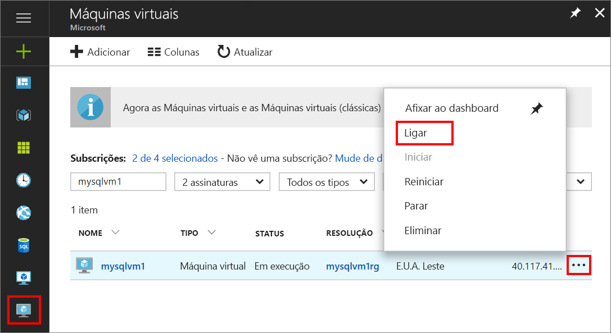
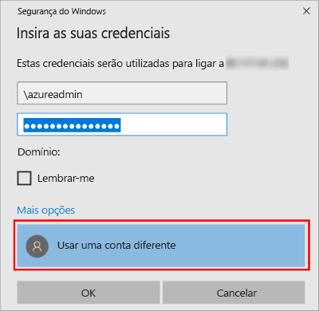

1. Depois de a máquina virtual do Azure ser criada e estar em execução, clique no ícone Máquinas Virtuais no portal do Azure para ver as VMs.

1. Clique nas reticências, **...** , da nova VM.

1. Clique em **Ligar**.

   

1. Abra o ficheiro **RDP** transferido pelo browser para a VM.

1. A Ligação ao Ambiente de Trabalho Remoto notifica-o de que não é possível identificar o publicador desta ligação remota. Clique em **Ligar** para continuar.

1. Na caixa de diálogo **Segurança do Windows**, clique em **Utilizar uma conta diferente**. Poderá ter de clicar em **Mais opções** para ver isto. Especifique o nome de utilizador e a palavra-passe que configurou quando criou a VM. Tem de adicionar uma barra invertida antes do nome de utilizador.

   

1. Clique em **OK** para ligar.
